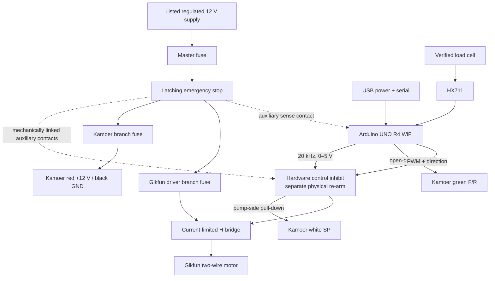

# Calibration Harness Build Sheet

Status: Proposed for Milestone 2 review. Water-only open-bench prototype.

This fixture compares two pump models as bench specimens:

- **Kamoer KPHM600-12B3B17** — 12 V brushless, three rollers, B17
  PharMed BPT tube, manufacturer reference flow 600 mL/min.
- **Gikfun AE1207** — 12 V two-wire brushed dosing pump, seller reference
  flow 0–100 mL/min and 2 mm ID × 4 mm OD tube.

Those rates are product metadata, not calibration results. They were measured
or advertised under different conditions and are not directly comparable.

The physical pump on the bench is a **specimen**. The final machine will have
three **channels**. A model, specimen, and channel must have separate IDs in the
data model.

## Stop Before Wiring

Inspect the received parts and photograph the markings. The load-cell bundle's
product title does not prove whether each sensor is a four-wire full bridge or a
three-wire half bridge.

| Observation | Build path |
| --- | --- |
| One 1 kg beam sensor has four signal wires | Use one beam sensor and one HX711 for the first scale. Mount it as a cantilever. Keep the other three sets as spares. |
| Each sensor has three wires | Use all four corner sensors through a load-cell combinator to create one full Wheatstone bridge, then use one HX711. |
| Pin labels, wire count, or resistance do not match either path | Stop and identify the exact part before connecting excitation power. |

Never infer the sensor pinout from wire color alone. Confirm the vendor diagram.
Resistance measurements can help map bridge topology, but on a balanced
four-wire bridge they generally cannot identify excitation versus signal or
polarity by themselves. If no trustworthy pinout exists, use a reviewed,
current-limited, low-voltage excitation procedure and a known applied load to
verify the mapping and sign before normal connection. Record the evidence and
verified mapping in the bench log.

## Mechanical Layout

```text
WET / DRAINED ZONE                 BARRIER             DRY / PROTECTED ZONE

reservoir -> closed tubing -----> pump head     | motor, connector, driver
                                                | fuses, Arduino, E-stop logic
                   slack loop -> fixed nozzle   |
                                     | air gap  |
                                     v          |
                           graduated cylinder   |
                         +---------------------+ |
                         | removable top plate | |
                         +----------+----------+ |
                                    |            |
                              load-cell beam ----+--> HX711 in enclosure
                         +----------+----------+ |
                         | isolated scale base | |
                         +---------------------+ |

removable spill tray and drain path             | no electronics below spills
```

### Base and pump mounts

- Use a rigid base, such as approximately 12 mm sealed plywood or 6–10 mm
  acrylic. Final thickness depends on the actual span and fasteners.
- Put the pumps and scale on separate rigid sub-bases. Do not let pump vibration
  flex the scale base.
- Use slotted, labelled specimen mounts so either pump can be installed without
  changing reservoir, head height, or outlet position.
- Add a removable spill tray under every wet component.
- Orient or shroud each integrated pump so its tube/head service points drain to
  the wet tray while its motor connector and electrical side remain behind the
  splash barrier. Do not put an unprotected motor connector in a leak path.
- The load-cell beam may cross the wet boundary, but its HX711 board belongs in
  a nearby dry enclosure. Keep the low-level cell cable short, strain-relieved,
  and away from motor wiring.
- Keep all exposed electronics beyond a vertical splash shield, above the
  highest possible spill path, and out from underneath the reservoir, tubing,
  nozzle, and vessel.

### Preferred single-beam scale

If the supplied cells are four-wire full-bridge beams:

1. bolt the fixed end of one beam to the scale base;
2. bolt a separate cylinder platform to the live end with rigid spacers;
3. keep the strain-gauge section and live end clear of the base;
4. strain-relieve the cable on the fixed side only;
5. add an adjustable mechanical overload stop below the live plate;
6. add a removable cylinder locating ring without touching the fixed base; and
7. center the cylinder over the intended load point.

Do not clamp both ends of the beam to the same plate. The one-kilogram rating
includes the platform, cylinder, and liquid. Weigh those items before choosing
the maximum collection mass.

### Four-corner alternative

If the supplied sensors are three-wire half bridges:

- mount four sensors at equal distances under a rigid platform;
- orient them according to the part documentation;
- use a load-cell combinator, not four guessed parallel connections;
- verify corner loading with the same reference mass at the center and all four
  corners; and
- use one combined HX711 reading as the platform mass.

### Prevent false weight

- Clamp the outlet nozzle to the bench, not the cylinder or scale plate.
- Maintain an air gap above the vessel.
- Add a slack tube loop between the pump and fixed nozzle.
- Do not let tubing, wires, shields, or a spill tray touch the live platform.
- Route liquid down the inside wall when possible to reduce splash and vertical
  jet-force artifacts.
- Keep reservoir level, inlet/outlet lengths, lift, and outlet height fixed and
  record them with the trial.

## Electrical Architecture

Use an Arduino UNO R4 WiFi for the planned build. The first transport is USB;
the Wi-Fi radio is not in the safety or timing path.



The emergency stop removes 12 V from both pumps while leaving USB power on so
the controller can report the stop. Its mechanically linked auxiliary contacts
also force the pump-side Kamoer `SP` low and inhibit H-bridge commands without
firmware. This prevents an energized USB GPIO from back-powering an unpowered
pump input and prevents release of the emergency stop from restarting a pump if
the controller is hung. Releasing the stop does not restore the hardware enable;
a separate physical re-arm is accepted only while firmware reports `IDLE` and
the interlock verifies that all command outputs are physically low. Logic ground
and 12 V ground meet at one documented star point.

### Proposed pin allocation

This table is a firmware contract, not permission to wire unverified hardware.

| UNO R4 pin | Function | Interface note |
| --- | --- | --- |
| D4 | HX711 `DOUT` | Digital input from the one selected HX711. |
| D5 | HX711 `SCK` | Keep low when idle; do not share with motor switching. |
| D3 | Optional HX711 `RATE` | Only if the actual module exposes a verified rate input. Default with a hardware pull-down to 10 SPS; drive high for 80 SPS transient mode. Review/remove any board-level hard strap first. |
| D6 | Kamoer direction control | Drives an open-drain transistor. Do not drive the green wire high. Ground selects forward; floating selects reverse per the Kamoer sheet. |
| D9 | Kamoer white `SP` | GPT-generated 20 kHz, 0–5 V PWM through the hardware control inhibit. Put the off-state pull-down on the pump side of that gate. |
| D10, D11 | Gikfun H-bridge control | Logic inputs with pull-downs and hardware inhibit; exact PWM allocation depends on the selected driver module. |
| D2 | Optional Kamoer yellow `FG` | Test point only until the signal voltage/type is scoped. Manufacturer states one pulse/revolution but does not specify interface voltage. |
| D7 | Emergency-stop sense | Auxiliary low-voltage contact only; the hard stop does not depend on firmware. |

Many low-cost HX711 modules hard-wire `RATE` rather than exposing it. Trace and
photograph the actual board before assigning D3. If 80 SPS cannot be selected
cleanly, record that limitation and do not run or label a one-second transient
test as 80 SPS; modify the board only under a reviewed wiring procedure or use a
module with an accessible rate input.

The Kamoer red and black wires receive steady 12 V. Do not PWM the red motor
power lead. Its internal brushless controller expects speed commands on the
white wire. The manufacturer specifies 5 V PWM at 10–30 kHz, with 0–10% stopped
and 11–100% in the regulation interval; use 20 kHz for V1.

The Gikfun is a two-wire brushed motor and must not connect to an Arduino GPIO.
Use a DRV8871-class bidirectional, current-limited H-bridge or another reviewed
driver with adequate measured startup/running margin and a conservative fault
current limit. A DRV8871 supports 12 V, bidirectional PWM control, and integrated
protection, but the breakout, current-limit resistor, thermal design, power-off
input behavior, and actual motor current still require validation.

Do not put a single flyback diode directly across a motor driven by an H-bridge;
that would defeat reversal. Use the driver's specified recirculation and
decoupling network.

## Preliminary Bill of Materials

Quantities and protection values marked **TBD after measurement** are deliberate.

| Qty | Item | Status / selection rule |
| ---: | --- | --- |
| 1 | Arduino UNO R4 WiFi + data-capable USB cable | Selected for planned build. |
| 1 | Kamoer KPHM600-12B3B17 specimen | User-selected. |
| 1 | Gikfun AE1207 specimen | User-selected. |
| 1 | Supplied 1 kg load cell + HX711 | Use one if confirmed four-wire full bridge. |
| 1 | Load-cell combinator | Only if sensors are three-wire half bridges. |
| 1 | DRV8871-class current-limited H-bridge breakout | Confirm current-limit configuration after measuring Gikfun startup and primed running current; validate faults with a dummy load rather than deliberately stalling the pump. |
| 1 | Regulated, listed 12 V supply | Size from worst allowed simultaneous startup/current-limit demand and continuous load, with engineering margin; 3–5 A is a preliminary procurement range, not a measured requirement. |
| 1 | Latching emergency-stop switch with DC-rated pump-power contacts and mechanically linked auxiliary contacts | At least one normally closed contact is dedicated to hardware control inhibit; use a separate contact or isolated state sense for the Arduino event input. |
| 1 | Hardware control-inhibit and separate physical re-arm circuit | Must force pump-side `SP` and H-bridge commands off with USB still powered, remain inhibited when the E-stop is released, reject re-arm while any command input is physically high, and fail off on broken control wiring. |
| 1 | Master fuse and two branch fuses/holders | Ratings TBD from measured load, wire gauge, driver, and supply. |
| 1 | 12 V distribution block with locking terminals | Keep exposed mains off the bench. |
| 1 | Bulk capacitor and local ceramic decoupling | Select per driver/pump data sheets; preliminary distribution target is 470 µF/25 V plus local 100 nF. |
| 1 | 12 V TVS and reverse-polarity protection | Select against the actual supply and driver limits. |
| 1 | Open-drain transistor interface for Kamoer F/R | Component and bias values reviewed before assembly. |
| 1 | Rigid base, separate scale sub-base, top plate, and spill tray | Wood or acrylic; keep the live platform mechanically isolated. |
| 1 | Cylinder locating ring and adjustable overload stop | Sized after cylinder and cell inspection. |
| 1 | Reference-mass set with stated tolerances | Span the intended operating range; its uncertainty must be comfortably below the scale gate. Do not use ingredient packages as standards. |
| 1 | Current-limited 12 V bench supply | Required for first Gikfun energization and characterization. An inline meter is not a substitute for current limiting. |
| 1 | Inline current probe or meter | Used in addition to the current-limited source to capture startup and running current. |
| 1 | Oscilloscope with probes rated for the possible signal voltage | Required to verify Kamoer `SP`, qualify unknown `FG` voltage/type, and verify output timing. A logic analyzer may be used only after voltage compatibility is known. |
| 1 | Reference thermometer/contact temperature probe with stated accuracy | Required to record liquid temperature for density conversion and bounded pump-case temperature checks. |
| 1 | Food-path tubing/fittings | **Not selected.** Water-only tests may use supplied tubing; ingredient use waits for documented compatibility. |

## Assembly and Bring-Up

### 1. Dry mechanical inspection

- Photograph every part and label each pump specimen.
- Weigh the platform and empty cylinder.
- Confirm free movement and overload-stop clearance.
- Place reference mass at center and off-center positions before any pump is
  mounted nearby.

### 2. Power distribution only

- Keep pumps and Arduino disconnected.
- Verify supply polarity, emergency-stop operation, branch isolation, and no
  exposed mains.
- Confirm the stop removes branch voltage and independently forces the
  pump-side control outputs low while USB remains powered.
- Release the stop and confirm pump power/control remain inhibited until the
  separate physical re-arm is deliberately operated from a proven-off state.

### 3. Controller and scale only

- Power the UNO from USB.
- Connect one verified HX711 path.
- Warm up, tare, calibrate, and record drift with pumps unpowered.
- Repeat with pump wiring physically installed but still unpowered to expose
  mechanical interference.

### 4. Kamoer control

- Leave the pump wet path empty and its `FG` wire disconnected.
- With the pump disconnected, verify the pump-side output of the hardware gate
  is 20 kHz and 0–5 V at 0%, minimum test duty, and 100%.
- While commanding a nonzero duty, press the emergency stop and verify the
  pump-side `SP` is forced low. Release it and verify `SP` remains inhibited
  until the separate re-arm sequence.
- Confirm reset and watchdog force `SP` low.
- Apply fused, current-monitored 12 V, perform a brief bounded run, and record
  Kamoer startup and primed running current.
- Scope `FG` separately before connecting it to D2.

### 5. Gikfun control

- Begin with a current-limited supply and motor disconnected from the driver.
- Verify both outputs, coast/stop, forward, reverse, and reset pull-downs.
- Connect the motor, measure startup/running current, and set the driver current
  limit and branch protection from those measurements.
- Do not lock or deliberately stall the pump. Validate driver current limiting,
  branch protection, and fault recovery against an electrical dummy load.
- Perform a brief bounded, primed run and record case temperature with the
  identified temperature instrument.

### 6. First wet test

- Use water only and prime to a waste vessel.
- Put the empty graduated cylinder on the scale and tare it.
- Verify the fixed outlet and tube do not touch the live platform.
- Run one low-risk, bounded collection step.
- Press the physical stop during a second brief run and retain the resulting
  fault/event data.

## Scale Qualification

Before collecting qualification data, predeclare the HX711 sample mode, filter,
zero-RMS calculation, residual statistic, test window, and reference-mass
tolerances. Warm the electronics for 15–30 minutes. With the actual platform
and cylinder:

1. capture zero for at least 60 seconds;
2. calibrate against at least four reference masses spanning the intended range;
3. run increasing and decreasing loads to expose hysteresis;
4. repeat center and off-center placements;
5. verify the fitted calibration with at least one independent check mass not
   used in the fit;
6. fit raw counts to grams and retain residuals; and
7. repeat zero after pumps have run to expose thermal or electrical drift.

Initial engineering gates, subject to actual sensor performance:

- filtered zero RMS no worse than 0.2 g;
- calibration residual no worse than 0.5 g;
- zero drift no worse than 0.5 g over 60 seconds; and
- no meaningful center/corner difference over the collection range.

These are provisional go/no-go targets, not claims about the purchased kit. If
the rig misses them, fix mechanics, grounding, cable routing, filtering, or
sensor selection before changing software to hide the error.

## Timing and Temperature Qualification

Mass-over-time is only as accurate as the controller timebase. Before accepting
a flow curve:

1. observe the actual pump-enable/control output with the oscilloscope for
   commanded 1 s, 2 s, 5 s, and 60 s intervals;
2. record measured duration error and run-to-run jitter;
3. predeclare an allowed timing error from the total flow-uncertainty budget;
4. correct the implementation or propagate measured timing uncertainty if the
   gate is missed; and
5. record liquid temperature with the identified reference thermometer at the
   start and end of each trial, using density for the measured temperature.

Do not describe device time as exact until this qualification passes. Use the
same temperature instrument or a separately identified contact probe for pump
case-temperature checks; an uncalibrated infrared estimate is only a diagnostic.

## Safety Boundary

- The open bench is water-only.
- Use a listed, enclosed low-voltage supply and keep mains connections off the
  wet bench.
- The Gikfun uses a brushed motor and is a potential spark source. Do not test
  ethanol near exposed electronics or a brushed motor without a reviewed
  enclosure and vapor/fire assessment.
- Supplied tubing is not presumed food-safe or alcohol-compatible.
- Add eye protection during current-limited motor tests and secure loose hair,
  sleeves, and tubing around rotating equipment.
- Releasing the emergency stop must never restart a pump; a separate deliberate
  re-arm is required.
- Never leave a powered trial unattended.

## Source Notes

- [Kamoer KPHM600 data sheet](https://m.media-amazon.com/images/I/914PeMOVWiL.pdf)
  provides the five-wire interface, 0.8 A reference current, B17 tube, reference
  flow, 10–30 kHz control range, and one-pulse-per-revolution feedback claim.
- [Gikfun AE1207 product page](https://gikfun.com/products/gikfun-12v-dc-dosing-pump-peristaltic-dosing-head-with-connector-for-arduino-aquarium-lab-analytic-diy)
  is product-listing evidence only; it does not publish a driver or stall-current
  data sheet.
- [TI DRV8871 documentation](https://www.ti.com/product/DRV8871) covers the
  candidate H-bridge's operating range and protection features.
- [SparkFun's HX711/load-cell guide](https://learn.sparkfun.com/tutorials/load-cell-amplifier-hx711-breakout-hookup-guide/all)
  explains the distinction between full-bridge cells and four combined
  three-wire sensors.
