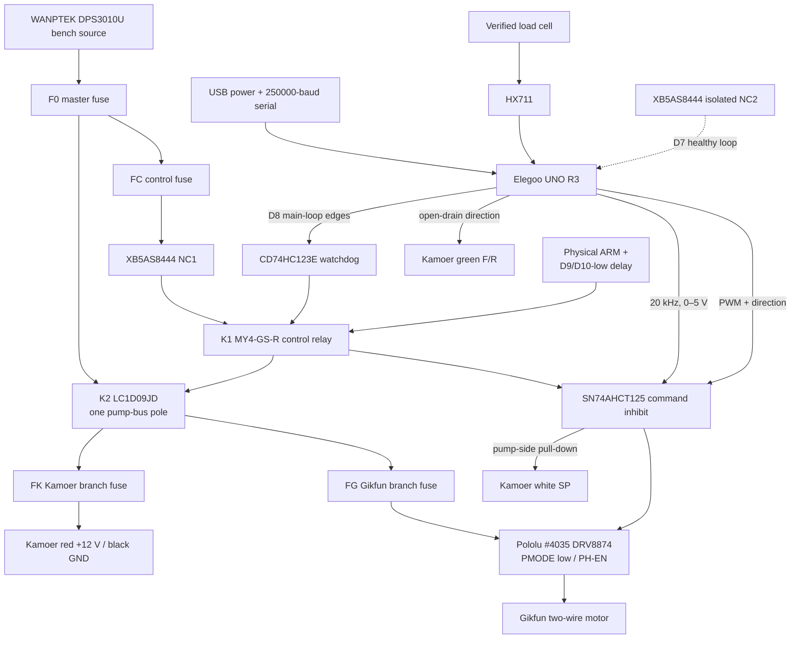

# Calibration Harness Build Sheet

Status: Milestone 2 build-sheet baseline implemented. Water-only open-bench
prototype; received-part inspection, schematic release, and physical proof are
still required.

This fixture compares two pump models as bench specimens:

- **Kamoer KPHM600-12B3B17** — 12 V brushless, three rollers, B17
  PharMed BPT tube, manufacturer reference flow 600 mL/min.
- **Gikfun AE1207** — 12 V two-wire brushed dosing pump, seller reference
  flow 0–100 mL/min and 2 mm ID × 4 mm OD tube.

Those rates are product metadata, not calibration results. They were measured
or advertised under different conditions and are not directly comparable.

The physical pump on the bench is a **specimen**. The final machine will have
three **channels**. A model, specimen, and channel must have separate IDs in the
data model.

## Stop Before Wiring

The supplied kit is SazkJere model `SJ18`, Amazon ASIN `B0B9Y584JR`. Its live
listing describes four separate 1 kg, four-lead cantilever cells and four HX711
modules. It maps red to `E+`, black to `E-`, green to `A+`, and white to `A-`.
That is enough to select a one-cell/one-HX711 topology, but marketplace copy is
not a substitute for inspecting the received parts.

| Observation | Build path |
| --- | --- |
| One received cell has the listed four wires and one board has matching `E+`, `E-`, `A+`, and `A-` labels | Use that one cell and one HX711. Mount the cell as a cantilever and keep the other three sets as spares. |
| Wire count, markings, or terminal labels differ from the listing | Stop. Do not substitute a half-bridge or guessed pinout; identify the received variant before applying excitation. |

Never infer the sensor pinout from wire color alone. Confirm the vendor diagram.
Resistance measurements can help map bridge topology, but on a balanced
four-wire bridge they generally cannot identify excitation versus signal or
polarity by themselves. If no trustworthy pinout exists, use a reviewed,
current-limited, low-voltage excitation procedure and a known applied load to
verify the mapping and sign before normal connection. Record the evidence and
verified mapping in the bench log.

## Mechanical Layout

```text
WET / DRAINED ZONE                 BARRIER             DRY / PROTECTED ZONE

reservoir -> closed tubing -----> pump head     | motor, connector, driver
                                                | fuses, Arduino, E-stop logic
                   slack loop -> fixed nozzle   |
                                     | air gap  |
                                     v          |
                           graduated cylinder   |
                         +---------------------+ |
                         | removable top plate | |
                         +----------+----------+ |
                                    |            |
                              load-cell beam ----+--> HX711 in enclosure
                         +----------+----------+ |
                         | isolated scale base | |
                         +---------------------+ |

removable spill tray and drain path             | no electronics below spills
```

### Base and pump mounts

- Use a rigid base, such as approximately 12 mm sealed plywood or 6–10 mm
  acrylic. Final thickness depends on the actual span and fasteners.
- Put the pumps and scale on separate rigid sub-bases. Do not let pump vibration
  flex the scale base.
- Use slotted, labelled specimen mounts so either pump can be installed without
  changing reservoir, head height, or outlet position.
- Add a removable spill tray under every wet component.
- Orient or shroud each integrated pump so its tube/head service points drain to
  the wet tray while its motor connector and electrical side remain behind the
  splash barrier. Do not put an unprotected motor connector in a leak path.
- The load-cell beam may cross the wet boundary, but its HX711 board belongs in
  a nearby dry enclosure. Keep the low-level cell cable short, strain-relieved,
  and away from motor wiring.
- Keep all exposed electronics beyond a vertical splash shield, above the
  highest possible spill path, and out from underneath the reservoir, tubing,
  nozzle, and vessel.

### Preferred single-beam scale

If the supplied cells are four-wire full-bridge beams:

1. bolt the fixed end of one beam to the scale base;
2. bolt a separate cylinder platform to the live end with rigid spacers;
3. keep the strain-gauge section and live end clear of the base;
4. strain-relieve the cable on the fixed side only;
5. add an adjustable mechanical overload stop below the live plate;
6. add a removable cylinder locating ring without touching the fixed base; and
7. center the cylinder over the intended load point.

Do not clamp both ends of the beam to the same plate. The one-kilogram rating
includes the platform, cylinder, and liquid. Weigh those items before choosing
the maximum collection mass.

The 100 mL cylinder is sufficient for bounded flow-curve collections. It cannot
receive a one-shot 160 mL recipe component. Recipe duration may be computed from
an accepted curve, but an end-to-end pour above the measured vessel cutoff needs
a larger separately qualified catch vessel.

### Prevent false weight

- Clamp the outlet nozzle to the bench, not the cylinder or scale plate.
- Maintain an air gap above the vessel.
- Add a slack tube loop between the pump and fixed nozzle.
- Do not let tubing, wires, shields, or a spill tray touch the live platform.
- Route liquid down the inside wall when possible to reduce splash and vertical
  jet-force artifacts.
- Keep reservoir level, inlet/outlet lengths, lift, and outlet height fixed and
  record them with the trial.

## Electrical Architecture

Use the supplied Elegoo UNO R3 for the planned build. Its ATmega328P is a 5 V,
16 MHz AVR with 2 KB SRAM. The transport is USB serial; this controller has no
onboard Wi-Fi.



The emergency stop's NC1 contact removes both 12 V coil feeds. K1 drops, its
seal opens, its command-gate contact disables the pump-side Kamoer `SP` and
DRV8874 commands, and K2 removes the pump bus. USB stays powered so isolated
NC2 can report the stop on D7. Releasing the E-stop cannot reseal K1. The
operator must press the separate ARM button after the external logic has seen
D9 and D10 continuously low. D8 does not statically enable K1: its rising edges
are inverted into falling-edge triggers for a `CD74HC123E`; lost edges expire its
output and drop K1. Logic ground and 12 V ground meet at one documented star
point. This layered circuit is a custom fail-off prototype, not a certified
safety function.

The point-to-point construction netlist, exact orderable parts, off-state
checks, and measurement-gated ratings are in
[`electronics/calibration-bench-bom.md`](../electronics/calibration-bench-bom.md).

### Proposed pin allocation

This table is a firmware contract, not permission to wire unverified hardware.

| UNO R3 pin | Function | Interface note |
| --- | --- | --- |
| D4 | HX711 `DOUT` | Digital input from the one selected HX711. |
| D5 | HX711 `SCK` | Keep low when idle; do not share with motor switching. |
| D3 | Reserved HX711 `RATE` | Do not connect in V1. The as-received module stays at its verified 10 SPS default until the board trace/strap is documented. |
| D6 | Kamoer direction control | Drives an open-drain transistor. Do not drive the green wire high. Ground selects forward; floating selects reverse per the Kamoer sheet. |
| D9 / `OC1A` | Kamoer white `SP` | Timer1 hardware PWM at 20 kHz, 0–5 V, through the hardware control inhibit. Put the off-state pull-down on the pump side of that gate. |
| D10 / `OC1B` | Gikfun PWM | Timer1 hardware PWM at the same 20 kHz through a pull-down and the hardware inhibit. |
| D11 | Gikfun direction | Static H-bridge command through a pull-down and the hardware inhibit; exact truth table depends on the reviewed driver carrier. |
| D2 | Optional Kamoer yellow `FG` | Test point only until the signal voltage/type is scoped. Manufacturer states one pulse/revolution but does not specify interface voltage. |
| D7 | Emergency-stop sense | Auxiliary low-voltage contact only; the hard stop does not depend on firmware. |
| D8 | External control-watchdog heartbeat | Main-loop software toggles this every 25 ms only outside `boot`/`fault` with a healthy D7 loop. It feeds a retriggerable external one-shot, never a relay or pump directly. Either a HIGH or LOW stall must let K1 drop. |

After received-label confirmation, connect HX711 `VCC` to the Uno 5 V rail,
`GND` to logic ground, `DT/DOUT` to D4, and `SCK` to D5. The listing's cell map
is red to `E+`, black to `E-`, green to `A+`, and white to `A-`; `B+`/`B-` are
unused. Power down before changing any cell lead. Do not connect `RATE` to D3 in
the first build.

Many low-cost HX711 modules hard-wire `RATE` rather than exposing it. Trace and
photograph this board before assigning D3. The first firmware operates at
10 SPS. If 80 SPS cannot later be selected cleanly, record that limitation and
do not label a short transient as 80 SPS; modify the board only under a reviewed
wiring procedure or replace it with a documented module.

Timer1 owns D9 and D10. Configure fast PWM directly with a prescaler of 1 and a
top count of 799 for 20 kHz; special-case fully off and fully on rather than
assuming the endpoint compare values behave like ordinary duty steps. Do not
use `analogWrite()` or a library such as Servo that reconfigures Timer1. Preserve
Timer0 for the Arduino timebase and qualify that timebase on the received board.

USB serial is 250000 8N1. This has an exact ATmega328P divider at 16 MHz, unlike
the earlier higher-rate proposal. Opening a serial port may reset an Uno-class
board, so every connection starts a new handshake with outputs off and never
resumes a prior run.

The Kamoer red and black wires receive steady 12 V. Do not PWM the red motor
power lead. Its internal brushless controller expects speed commands on the
white wire. The manufacturer specifies 5 V PWM at 10–30 kHz, with 0–10% stopped
and 11–100% in the regulation interval; use 20 kHz for V1.

The Gikfun is a two-wire brushed motor and must not connect to an Arduino GPIO.
The preferred driver is Pololu DRV8874 carrier item `#4035`. Tie `PMODE` LOW
before waking the carrier so it latches PH/EN mode: D10 drives `EN` at 20 kHz,
D11 drives `PH`, and the inverted hardware-inhibit net drives `SLEEP` with a
local pull-down. The carrier is documented for 4.5–37 V and about 2.1 A
continuous under Pololu's open-air test conditions. Its roughly 4.4 A default
limit is not accepted for the unknown pump. Measure startup and primed-running
current, then select and validate the VREF resistor and closed-enclosure thermal
envelope. If the measured envelope does not fit, select a larger documented
driver instead of defeating current regulation.

Do not put a single flyback diode directly across a motor driven by an H-bridge;
that would defeat reversal. Use the driver's specified recirculation and
decoupling network.

## Preliminary Bill of Materials

Quantities and protection values marked **TBD after measurement** are deliberate.

| Qty | Item | Status / selection rule |
| ---: | --- | --- |
| 1 | Elegoo UNO R3 + data-capable USB cable | Supplied controller; verify exact board revision and USB bridge/VID/PID. |
| 1 | Kamoer KPHM600-12B3B17 specimen | User-selected. |
| 1 | Gikfun AE1207 specimen | User-selected. |
| 1 of 4 | SazkJere `SJ18` 1 kg four-wire beam + one supplied HX711 | Use one listed pair after received wire/terminal inspection. Leave `RATE` at the verified 10 SPS default. |
| 1 | Qesdaoxu 100 mL borosilicate cylinder, ASIN `B0BLHDVC1N` | Catch vessel only. Measure empty mass, dimensions, and a conservative working fill line; the listing publishes no volumetric tolerance/class. |
| 1 | Pololu DRV8874 carrier `#4035` | Preferred Gikfun PH/EN driver. Tie PMODE LOW; gate SLEEP; select VREF only after current/thermal measurement; validate current limiting with an electrical dummy load rather than deliberately stalling the pump. |
| 1 | WANPTEK POWER `DPS3010U` bench supply, ASIN `B0CN989377` | Supplied 0–30 V/0–10 A CV/CC source. Before use, verify received rating/grounding labels, input-voltage revision, 12 V output, negative-to-earth relationship, and current-limit behavior. Marketplace copy does not establish an NRTL mark. |
| 1 each | Schneider `XB5AS8444` two-NC E-stop and `XB5AA31` one-NO ARM button | NC1 removes K1/K2 coil feed; isolated NC2 only reports D7. Pump current does not pass through the operator switch. |
| 1 each | Omron `MY4-GS-R DC12`, `PYFZ-14-E`, `PYC-A1`; Schneider `LC1D09JD` | K1 non-latching four-pole control relay without a manual latch/test lever; K2 12 VDC-coil pump-bus contactor, one power pole only. Final K2 approval remains gated by measured DC inrush/current. |
| 1 each | TI `SN74AHCT125N`, `SN74HC14N`, `CD74HC123E`; PN2222; three 2N7000; passives | Command gate, SLEEP inversion, D9/D10-low ARM delay, external D8 edge-loss watchdog, K1 sink, and Kamoer open-drain direction. Use a soldered assembly and the point-to-point netlist, not a plug-in breadboard. |
| 4 | Littelfuse `0FHM0001SXJ` holders and selected 297-series fuses | F0 master, FC control, FK Kamoer, FG Gikfun. Buy holders/family now; amperages remain TBD from measured loads, wire/terminal ratings, driver limit, and the 297 time-current curve. |
| as laid out | Phoenix Contact `PT 2,5` 3209510 terminal family and 35 mm rail | Locking labelled distribution; exact count follows the full-size enclosure layout. |
| 1 each | Hammond `PCJ12106CCLF` enclosure and `PCJR1109` panel | Confirm component fit, bend radius, heat, and gland positions before drilling. |
| 1 | Bulk capacitor and local ceramic decoupling | Select from the driver data sheet and measured rail transients; no capacitance value is accepted before that review. |
| 1 | 12 V TVS and reverse-polarity protection | Select against the actual supply and driver limits. |
| 1 | Open-drain transistor interface for Kamoer F/R | Component and bias values reviewed before assembly. |
| 1 | Rigid base, separate scale sub-base, top plate, and spill tray | Wood or acrylic; keep the live platform mechanically isolated. |
| 1 | Cylinder locating ring and adjustable overload stop | Sized after cylinder and cell inspection. |
| 1 fit set + 1 check | Rice Lake Class 4 `13289` 50 g, `13271` 100 g, `13273` 200 g, plus a second serialized `13271` | Order every mass with the Accredited certificate option; reserve the second 100 g only for independent checking. Add a certified 500 g mass only if the measured span requires it. |
| 1 | Inline current probe or meter | Used in addition to the current-limited source to capture startup and running current. |
| 1 | Oscilloscope with probes rated for the possible signal voltage | Required to verify Kamoer `SP`, qualify unknown `FG` voltage/type, and verify output timing. A logic analyzer may be used only after voltage compatibility is known. |
| 1 | ThermoWorks Reference Thermapen `THS-222-215` | Certified immersion/contact temperature reference for water density and bounded case-temperature checks. |
| 1 | Food-path tubing/fittings | **Not selected.** Water-only tests may use supplied tubing; ingredient use waits for documented compatibility. |

## Assembly and Bring-Up

### 1. Dry mechanical inspection

- Photograph every part and label each pump specimen.
- Weigh the platform and empty cylinder.
- Confirm free movement and overload-stop clearance.
- Place reference mass at center and off-center positions before any pump is
  mounted nearby.

### 2. Power distribution only

- Keep pumps and Arduino disconnected.
- Verify supply polarity, emergency-stop operation, branch isolation, and no
  exposed mains.
- Confirm the stop removes branch voltage and independently forces the
  pump-side control outputs low while USB remains powered.
- Release the stop and confirm pump power/control remain inhibited until the
  separate physical re-arm is deliberately operated from a proven-off state.
- Stop D8 edges HIGH and LOW in turn with a commissioning-only firmware build;
  in both cases verify the `CD74HC123E` pulse expires, K1 and K2 drop, pump-side
  `SP`/`EN` are low, and another physical ARM action is required. Record actual
  edge interval, one-shot window, K1/K2 release, and output-off latency.

### 3. Controller and scale only

- Power the UNO from USB.
- Connect one verified HX711 path.
- Flash the commissioning firmware with the default unprovisioned device ID,
  zero counts-to-gram factor, and zero vessel mass limit. Confirm its `hello`
  frame reports the scale/limit as unavailable and that a `run` command is
  rejected fail-off.
- Verify each reconnect/reset creates a new reset-session ID, resets the host
  command high-water to zero, and leaves D9/D10 low.
- Warm the unprovisioned scale and stream raw zero/reference-mass observations;
  the shipped zero tare-stability threshold intentionally rejects `tare`.
  Derive and review the threshold and rational counts-to-gram factor from those
  observations, rather than bypassing the gate.
- Provision a unique device ID, the reviewed rational counts-to-gram factor, and
  the reviewed tare-stability threshold and measured conservative liquid-mass
  limit in a reviewed firmware change; rebuild, complete a real firmware tare,
  and repeat the outputs-off tests before any physical run.
- Repeat with pump wiring physically installed but still unpowered to expose
  mechanical interference.

### 4. Kamoer control

- Leave the pump wet path empty and its `FG` wire disconnected.
- With the pump disconnected, verify the pump-side output of the hardware gate
  is 20 kHz and 0–5 V at 0%, minimum test duty, and 100%.
- While commanding a nonzero duty, press the emergency stop and verify the
  pump-side `SP` is forced low. Release it and verify `SP` remains inhibited
  until the separate re-arm sequence.
- Confirm reset and watchdog force `SP` low.
- Apply fused, current-monitored 12 V, perform a brief bounded run, and record
  Kamoer startup and primed running current.
- Scope `FG` separately before connecting it to D2.

### 5. Gikfun control

- Begin with a current-limited supply and motor disconnected from the driver.
- Verify both outputs, coast/stop, forward, reverse, and reset pull-downs.
- Connect the motor, measure startup/running current, and set the driver current
  limit and branch protection from those measurements.
- Do not lock or deliberately stall the pump. Validate driver current limiting,
  branch protection, and fault recovery against an electrical dummy load.
- Perform a brief bounded, primed run and record case temperature with the
  identified temperature instrument.

### 6. First wet test

- Use water only and prime to a waste vessel.
- Put the empty graduated cylinder on the scale and tare it.
- Verify the fixed outlet and tube do not touch the live platform.
- Run one low-risk, bounded collection step.
- Press the physical stop during a second brief run and retain the resulting
  fault/event data.

## Scale Qualification

Before collecting qualification data, predeclare the HX711 sample mode, filter,
zero-RMS calculation, residual statistic, test window, and reference-mass
tolerances. Warm the electronics for 15–30 minutes. With the actual platform
and cylinder:

1. capture zero for at least 60 seconds;
2. calibrate against at least four reference masses spanning the intended range;
3. run increasing and decreasing loads to expose hysteresis;
4. repeat center and off-center placements;
5. verify the fitted calibration with at least one independent check mass not
   used in the fit;
6. fit raw counts to grams and retain residuals; and
7. repeat zero after pumps have run to expose thermal or electrical drift.

Initial engineering gates, subject to actual sensor performance:

- filtered zero RMS no worse than 0.2 g;
- calibration residual no worse than 0.5 g;
- zero drift no worse than 0.5 g over 60 seconds; and
- no meaningful center/corner difference over the collection range.

These are provisional go/no-go targets, not claims about the purchased kit. If
the rig misses them, fix mechanics, grounding, cable routing, filtering, or
sensor selection before changing software to hide the error.

## Timing and Temperature Qualification

Mass-over-time is only as accurate as the controller timebase. Before accepting
a flow curve:

1. observe the actual pump-enable/control output with the oscilloscope for
   commanded 1 s, 2 s, 5 s, and 60 s intervals;
2. record measured duration error and run-to-run jitter;
3. predeclare an allowed timing error from the total flow-uncertainty budget;
4. correct the implementation or propagate measured timing uncertainty if the
   gate is missed; and
5. record liquid temperature with the identified reference thermometer at the
   start and end of each trial, using density for the measured temperature.

Do not describe device time as exact until this qualification passes. Use the
same temperature instrument or a separately identified contact probe for pump
case-temperature checks; an uncalibrated infrared estimate is only a diagnostic.

## Safety Boundary

- The open bench is water-only.
- Keep the WANPTEK supply outside the wet bench, use a grounded receptacle, and
  do not energize it until the received grounding/rating label and output
  behavior are verified. It does not replace downstream fuses or the E-stop.
- The Gikfun uses a brushed motor and is a potential spark source. Do not test
  ethanol near exposed electronics or a brushed motor without a reviewed
  enclosure and vapor/fire assessment.
- Supplied tubing is not presumed food-safe or alcohol-compatible.
- Add eye protection during current-limited motor tests and secure loose hair,
  sleeves, and tubing around rotating equipment.
- Releasing the emergency stop must never restart a pump; a separate deliberate
  re-arm is required.
- Never leave a powered trial unattended.

## Source Notes

- [Kamoer KPHM600 data sheet](https://m.media-amazon.com/images/I/914PeMOVWiL.pdf)
  provides the five-wire interface, 0.8 A reference current, B17 tube, reference
  flow, 10–30 kHz control range, and one-pulse-per-revolution feedback claim.
- [Gikfun AE1207 product page](https://gikfun.com/products/gikfun-12v-dc-dosing-pump-peristaltic-dosing-head-with-connector-for-arduino-aquarium-lab-analytic-diy)
  is product-listing evidence only; it does not publish a driver or stall-current
  data sheet.
- [Pololu DRV8874 carrier #4035](https://www.pololu.com/product/4035) documents
  the carrier's PH/EN mode, PMODE/SLEEP behavior, adjustable current regulation,
  and open-air thermal limits; the [TI DRV8874 data sheet](https://www.ti.com/product/DRV8874)
  governs the IC.
- [TI CD74HC123 documentation](https://www.ti.com/product/CD74HC123) defines the
  retriggerable falling-edge one-shot and the nominal `0.45 × R × C` timing
  relationship used only as a starting design value.
- [Omron MY4-GS-R relay family](https://www.ia.omron.com/products/family/3440/lineup.html),
  [Schneider XB5AS8444 catalog](https://iportal2.schneider-electric.com/Contents/docs/0100CT1501_SEC-19.PDF),
  and [Schneider LC1D09JD product page](https://www.se.com/us/en/product/LC1D09JD/)
  identify the exact control, E-stop, and pump-bus switching baseline.
- [Rice Lake's 2026 calibration-weight catalog](https://www.ricelake.com/media/v5wpljtq/2026_calibration_weights_2-1.pdf)
  identifies the selected Class 4 weight part numbers and accredited-certificate
  option.
- [SparkFun's HX711/load-cell guide](https://learn.sparkfun.com/tutorials/load-cell-amplifier-hx711-breakout-hookup-guide/all)
  explains the distinction between full-bridge cells and four combined
  three-wire sensors.
- [SazkJere load-cell/HX711 listing](https://www.amazon.com/dp/B0B9Y584JR)
  identifies model `SJ18`, the four-wire mapping, 2.6–5.5 V HX711 operation,
  and nominal 10/80 SPS options; received-part inspection still governs wiring.
- [WANPTEK DPS3010U listing](https://www.amazon.com/dp/B0CN989377) and its
  [Amazon-hosted manual](https://m.media-amazon.com/images/I/B1ArPmFcVpS.pdf)
  identify the adjustable CV/CC bench source and protection modes.
- [Qesdaoxu cylinder listing](https://www.amazon.com/dp/B0BLHDVC1N) identifies
  the nominal 100 mL borosilicate catch vessel but publishes no accuracy class.
- [Arduino UNO R3 documentation](https://docs.arduino.cc/hardware/uno-rev3/)
  and the [ATmega328P data sheet](https://content.arduino.cc/assets/ATmega328P_Datasheet.pdf)
  define the controller resources and Timer1/UART behavior used here.
