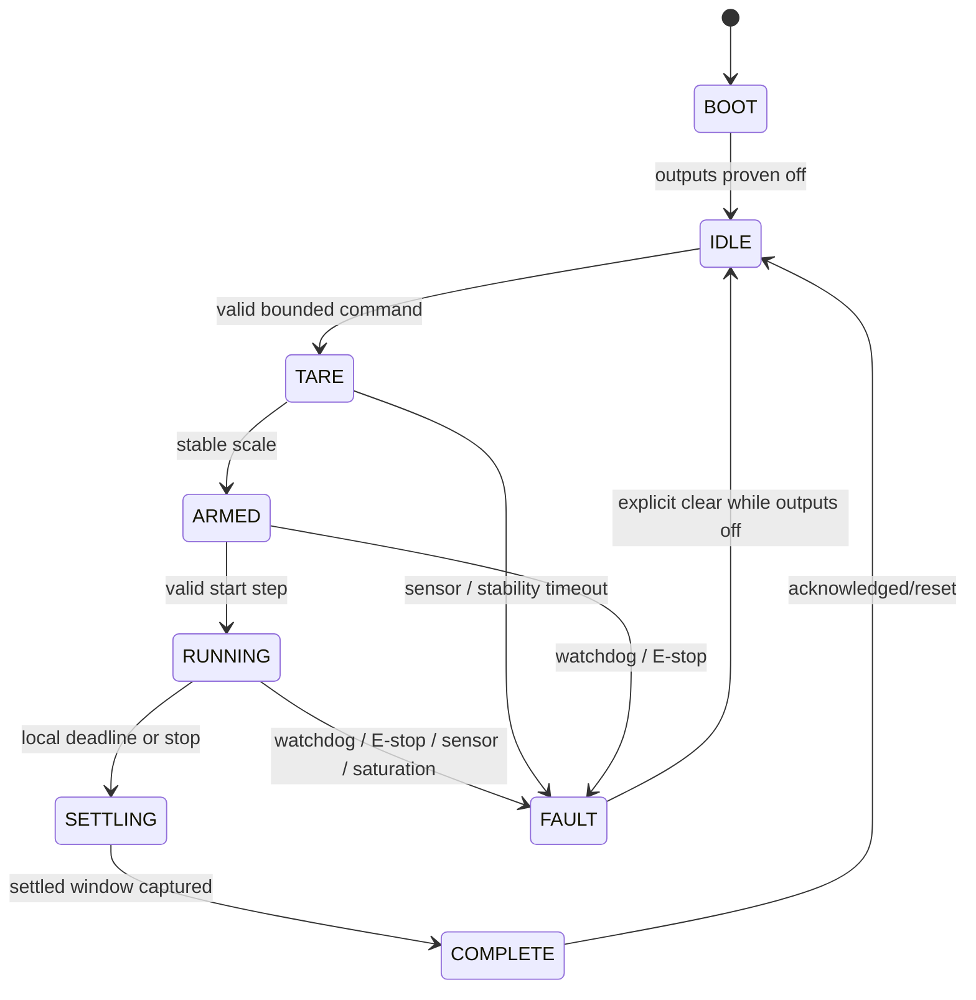

# Calibration Firmware, Protocol, and Cloud Plan

Status: Proposed contract for Milestone 2 review. This document specifies
software to build; it is not an implementation claim.

## Design Rules

1. The Arduino owns pump safety and exact step timing.
2. The browser owns operator interaction, USB serial, and an offline upload
   spool.
3. Cloudflare owns authorization, durable storage, live fanout, final analysis,
   and public reads.
4. A live viewer never becomes a remote motor controller.
5. Device monotonic time is measurement time; server receipt time is audit time.
6. Raw evidence is immutable. Derived results are versioned and superseded, not
   silently overwritten.

## Firmware State Machine



`BOOT`, parse errors, reset, disconnect, and `FAULT` always set both pump
outputs to off before emitting any response.

### Required local guards

- maximum command duration enforced by firmware;
- heartbeat timeout while armed or running;
- physical emergency-stop sense plus independent power cut;
- HX711 ready timeout and saturation fault;
- configurable maximum collected mass below vessel and sensor limits;
- mutually exclusive pump enables;
- direction change only after an off/dead-time interval;
- Kamoer duty clamped to the reviewed domain; and
- no automatic resume after USB reconnect or MCU reset.

The controller may complete a previously accepted bounded stop deadline without
the browser, but it must never wait for Cloudflare to stop a pump.

## Serial Protocol

Transport is UTF-8 newline-delimited JSON at **460800 8N1**. Control and state
events remain readable JSON, while high-rate measurements use compact sample
blocks. Maximum line length is 4096 bytes in firmware and the browser; oversize
or invalid lines create a fault/event rather than unbounded buffering.

The HX711 has two explicit acquisition modes:

- `steady_10_sps` for low-noise tare, drift, and steady-flow work; and
- `transient_80_sps` for the 1 s, 2 s, and 5 s start/stop tests.

At 80 SPS, the device emits a block at least every 50 ms rather than a verbose
object for every reading. A block carries shared trial/state fields plus compact
integer tuples such as `[deltaMs, rawAdc, massMg, dutyBasisPoints, flags]`.
The browser expands those tuples into the canonical events below before writing
the local spool. The device still assigns a distinct sequence number to every
sample. UI rendering may be throttled, but no stored sample is dropped.

The firmware must prove loss-free, non-blocking transmission at the selected
rate with worst-case frame sizes. If the actual UNO/USB path cannot sustain
that test, reduce payload size or use a binary sample block in protocol V2; do
not silently fall back to an under-sampled transient trial.

### Device identity and ordering

Every boot creates a random `bootId`. Every canonical event consumes the next
`seq`; a compact sample-block envelope therefore spans a declared contiguous
sequence range rather than consuming one sequence for the whole block.

```text
event identity = (deviceId, bootId, seq)
```

`deviceMs` is monotonic time since boot. It is never interpreted as wall-clock
time. The browser and server add their own receipt timestamps.

### Device-to-host frame types

```ts
type DeviceFrame =
  | {
      v: 1;
      type: 'hello';
      deviceId: string;
      bootId: string;
      seq: number;
      deviceMs: number;
      firmwareVersion: string;
      hardwareRevision: string;
      protocolVersion: 'tnp.serial.v1';
      capabilities: string[];
      serialBaud: 460800;
      acquisitionModes: Array<'steady_10_sps' | 'transient_80_sps'>;
    }
  | {
      v: 1;
      type: 'sample';
      deviceId: string;
      bootId: string;
      seq: number;
      deviceMs: number;
      trialId: string | null;
      stepIndex: number | null;
      state: BenchState;
      pumpSpecimenId: string | null;
      acquisitionMode: 'steady_10_sps' | 'transient_80_sps';
      expectedSampleIntervalMs: number;
      dutyBasisPoints: number;
      dutyTimerCount: number;
      motorOn: boolean;
      rawAdc: number[];
      massMg: number | null;
      tachCount: number | null;
      supplyMv: number | null;
      faults: FaultCode[];
    }
  | {
      v: 1;
      type: 'heartbeat' | 'command_ack' | 'state' | 'fault';
      deviceId: string;
      bootId: string;
      seq: number;
      deviceMs: number;
      trialId: string | null;
      commandId?: string;
      state: BenchState;
      expectedEventIntervalMs: number;
      code?: FaultCode;
      detail?: string;
    };

interface SampleBlockWireV1 {
  v: 1;
  type: 'sample_block';
  deviceId: string;
  bootId: string;
  firstSeq: number;
  baseDeviceMs: number;
  trialId: string;
  stepIndex: number;
  state: BenchState;
  pumpSpecimenId: string;
  acquisitionMode: 'steady_10_sps' | 'transient_80_sps';
  expectedSampleIntervalMs: number;
  // Each row consumes the next sequence number.
  rows: Array<[
    deltaMs: number,
    rawAdc: number,
    massMg: number | null,
    dutyBasisPoints: number,
    dutyTimerCount: number,
    flags: number,
    supplyMv: number | null
  ]>;
}
```

Fixed-point milligrams, millivolts, and duty basis points avoid ambiguous float
serialization. `null` means not measured; it is not zero. A wire-level sample
block is only a compression envelope: after expansion, each canonical event is
independently hashed and identified by `(deviceId, bootId, seq)`.
The bit assignments for `flags` live in shared generated protocol constants;
unknown required bits make a frame unsupported instead of being guessed.

### Host-to-device commands

```ts
type HostCommand =
  | { v: 1; type: 'hello'; commandId: string }
  | { v: 1; type: 'heartbeat'; commandId: string }
  | {
      v: 1;
      type: 'tare';
      commandId: string;
      trialId: string;
      minimumStableMs: number;
      maximumWaitMs: number;
    }
  | {
      v: 1;
      type: 'start_step';
      commandId: string;
      trialId: string;
      stepIndex: number;
      pumpSpecimenId: string;
      direction: 'forward' | 'reverse';
      dutyBasisPoints: number;
      warmupMs: number;
      collectionMs: number;
      settleMs: number;
      acquisitionMode: 'steady_10_sps' | 'transient_80_sps';
      hardStopMs: number;
      maximumMassMg: number;
    }
  | { v: 1; type: 'stop'; commandId: string; reason: string }
  | { v: 1; type: 'clear_fault'; commandId: string };

interface TrialPlanV1 {
  schema: 'tnp.calibration.plan.v1';
  planId: string;
  steps: Array<{
    stepIndex: number;
    repeatIndex: number;
    direction: 'forward' | 'reverse';
    dutyBasisPoints: number;
    warmupMs: number;
    collectionMs: number;
    settleMs: number;
    acquisitionMode: 'steady_10_sps' | 'transient_80_sps';
    maximumMassMg: number;
    hardStopMs: number;
  }>;
  maximumTrialMs: number;
}
```

The firmware validates state, numeric range, pump identity, deadline ordering,
and maximum allowed duration before acknowledging a step. A duplicated
`commandId` returns the stored acknowledgment and cannot start a second run.

## Browser Bridge

The operator uses the same `/calibration` page that renders the live readout.
The page exposes connection and run controls only after Cloudflare Access
authorizes the user; public viewers remain read-only.

### Serial responsibilities

- Require HTTPS, feature-detect `navigator.serial`, and request the port only
  from a user gesture.
- Parse incrementally and cap the line, queue, and in-memory history sizes.
- Validate every frame before it can affect UI or cloud data.
- Expand compact sample blocks without changing device sequence or time.
- Correlate commands and acknowledgments with bounded timeouts.
- Send heartbeats only while the page owns the bench.
- On page close or serial error, attempt `stop`; safety still depends on the
  firmware watchdog, not that attempt.

Web Serial has limited browser availability. V1 operator support is current
desktop Chromium. Read-only live viewing uses ordinary HTTPS/WebSocket and does
not require Web Serial. If browser support becomes a blocker, a local
TypeScript serial bridge may implement the same batch contract later.

### Offline spool

Before network upload, store every accepted trial event in IndexedDB keyed by
event identity. Build immutable batches from the spool. Connected-idle
heartbeats use the same identity/hash rules but may be compacted after the
`BenchCoordinator` returns its durable acknowledgment; active-trial heartbeats
remain spooled until their D1-projected frontier.

- Flush every 250–500 ms or 25 events, whichever comes first.
- Cap encoded request size at 64 KiB.
- Retain events until the server acknowledges their **D1-projected** contiguous
  sequence frontier for the same device and boot.
- Retry with exponential backoff and full jitter.
- Recover unacknowledged batches after reload.
- Surface spool depth and oldest unacknowledged age.
- Never discard raw frames merely because a later derived result succeeds.

HTTP delivery is at least once. The immutable event identity, payload hash, and
idempotent projection make durable effects effectively once; the plan does not
claim an exactly-once network upload. Losing an acknowledgment or rebuilding
the same events into a differently sized batch must be harmless.

## Cloudflare Topology

Keep one Worker and hostname:

- static React assets remain in `site/build/client`;
- add a Worker entrypoint and `ASSETS` binding;
- configure `assets.run_worker_first` for `/api/*`, `/calibration`, and
  `/calibration/*`;
- retain single-page-app fallback for direct `/calibration`; and
- use generated Wrangler binding types rather than a hand-written `Env`.

The Worker always handles `/api/*`: an unknown API route returns a JSON `404`,
and a non-upgraded live route returns `426`. Neither may fall through to the SPA.
For `/calibration`, it delegates to `ASSETS.fetch()` and adds the reviewed CSP
and `Permissions-Policy: serial=(self)` headers to the response. Other static
routes keep asset-first behavior.

One SQLite-backed `TrialCoordinator` Durable Object is addressed with
`getByName(trialId)`. Its SQLite storage owns trial state, producer ownership,
the ingest journal, stream-sequence allocation, and the bounded replay window.
A lightweight `BenchCoordinator` addressed with `getByName(benchId)` owns fresh
producer presence, connected-idle state, and the pointer to the active/recent
trial. D1 is the canonical normalized query store.

### Persist-before-publish path

1. Worker validates request method, content type, size, origin, Access JWT, and
   schema.
2. Worker routes the batch to the trial's Durable Object.
3. Durable Object validates producer ownership, batch identity, body hash,
   state transition, and sequence information.
4. In one Durable Object storage transaction, reserve ordered `streamSeq`
   values, write the immutable batch body/hash as `pending_projection`, and set
   the earliest drain alarm. Do not acknowledge durable projection yet.
5. The drain processes pending entries strictly in `streamSeq` order. It writes
   the batch, immutable device events, sample projections, and the new
   contiguous published frontier to D1 in one idempotent prepared `batch()`
   transaction.
6. A local transaction marks the journal entry projected, stores its
   acknowledgment/replay frame, and schedules the next alarm when work remains.
7. Only then does the object acknowledge the producer and broadcast through the
   contiguous projected frontier.

The alarm is the durable retry mechanism; an ingest request may opportunistically
drain but correctness never depends on that request remaining alive. Object
startup also inspects the persisted pending count and restores a missing alarm.
An alarm failure records bounded backoff and reschedules itself. Trial
completion is refused while the projection outbox is non-empty.

Do not depend on an awaited external D1 call to serialize Durable Object
requests. Use `blockConcurrencyWhile()` only for schema initialization. Public
D1 queries include rows no newer than the stored contiguous published frontier,
so a partially projected future row cannot leak into a read model.

If persistence fails, the live UI does not receive a sample that the system
cannot later explain.

### API v1

```text
GET  /api/v1/calibration/bootstrap?bench=bench-01
GET  /api/v1/benches/{benchId}/live
GET  /api/v1/trials/{trialId}
GET  /api/v1/trials/{trialId}/samples?cursor=...&through=...
GET  /api/v1/trials/{trialId}/live
GET  /api/v1/pump-models
GET  /api/v1/comparison?models=kamoer-kphm600-12b3b17,gikfun-ae1207
GET  /api/v1/recipes/predictions
GET  /api/v1/health

GET  /api/v1/operator/authorize?returnTo=/calibration
GET  /api/v1/operator/session
POST /api/v1/operator/benches/{benchId}/sessions
POST /api/v1/operator/benches/{benchId}/sessions/{sessionId}/heartbeats
DELETE /api/v1/operator/benches/{benchId}/sessions/{sessionId}
POST /api/v1/operator/trials
POST /api/v1/operator/trials/{trialId}/batches
POST /api/v1/operator/trials/{trialId}/lease/renew
POST /api/v1/operator/trials/{trialId}/lease/takeover
POST /api/v1/operator/trials/{trialId}/complete
POST /api/v1/operator/trials/{trialId}/abort
```

The live route requires a WebSocket upgrade. Page and read routes are public;
every route under `/api/v1/operator/*` is protected by Cloudflare Access and
Worker-side token validation. Public responses use explicit view models that
exclude operator identity, private notes, Access claims, leases, and ingest
diagnostics.

Direct `/calibration` uses `bench-01` from checked public configuration unless
a validated `?bench=` is supplied. Bootstrap returns fresh bench presence, the
active trial if exactly one exists, the latest completed trial, both pump read
models, and all six canonical recipes. With no active trial the page still
shows connected-idle presence and historical comparisons. A bench cannot own
multiple active trials; a conflicting start returns `409` rather than choosing
one arbitrarily.

Connecting serial creates an Access-bound bench producer session and returns a
high-entropy bench lease. Idle device heartbeats are written transactionally to
the `BenchCoordinator` and acknowledged with device/boot/sequence plus
`durableAt`; the bench WebSocket then fans out that durable presence. When a
trial is active, heartbeats travel through the trial event journal and are not
acknowledged as current until D1 projection. This gives connected-idle a real
end-to-end durability signal without manufacturing a trial.

### Trial creation contract

```ts
interface CreateTrialV1 {
  schema: 'tnp.calibration.create.v1';
  benchId: string;
  benchSessionId: string;
  deviceId: string;
  bootId: string;
  pumpSpecimenId: string;
  pumpModelId: string;
  transport: 'web_serial';
  firmwareVersion: string;
  protocolVersion: 'tnp.serial.v1';
  loadCellCalibrationId: string;
  fluid: {
    name: string;
    densityMgPerL: number;
    densitySource: string;
    temperatureMilliC: number | null;
  };
  setup: {
    tubeId: string;
    inletLengthMm: number | null;
    outletLengthMm: number | null;
    liftMm: number | null;
    nozzleHeightMm: number | null;
    supplyMv: number | null;
    pwmFrequencyHz: number;
  };
  plan: TrialPlanV1;
}
```

Product-listing flow is pump metadata and never seeds a measured field. The
server resolves the specimen record and rejects a supplied `pumpModelId` that
does not match it.

Trial creation must present the fresh bench-session lease and matching
device/boot identity. Successful creation returns a high-entropy, trial-scoped
producer lease exactly once. The `TrialCoordinator` stores only its
cryptographic hash and binds it to the Access subject, `benchId`, `deviceId`,
`bootId`, and a random `producerSessionId`. Every trial mutation requires both a
valid Access identity and that lease; neither lease is compiled into the SPA.

The browser keeps the lease in the same bounded local operator store as the
spool. An active producer renews a short expiry with heartbeats. Reload resumes
with the retained lease. If it is lost, an Access-authorized takeover atomically
revokes the old lease only after the bench reports pump-off and either the old
producer is stale or the operator explicitly aborts the trial. Releasing an
emergency stop never constitutes lease renewal or automatic run resumption.

### Batch and acknowledgment

```ts
interface IngestBatchV1 {
  schema: 'tnp.calibration.batch.v1';
  batchId: string;
  producerSessionId: string;
  trialId: string;
  deviceId: string;
  bootId: string;
  firstSeq: number;
  lastSeq: number;
  events: DeviceFrame[];
}

interface BatchAckV1 {
  schema: 'tnp.calibration.ack.v1';
  batchId: string;
  producerSessionId: string;
  deviceId: string;
  bootId: string;
  accepted: number;
  duplicates: number;
  contiguousProjectedThrough: number;
  missingRanges: Array<[number, number]>;
  publishedStreamSeq: number;
  serverReceivedAt: string;
  projectedAt: string;
  trialState: TrialState;
}

interface ProjectionQueuedV1 {
  schema: 'tnp.calibration.queued.v1';
  batchId: string;
  producerSessionId: string;
  state: 'pending_projection';
  retryAfterMs: number;
}
```

Batch identity is `(trialId, producerSessionId, batchId)` and also stores
`sha256(rawBody)`.

- Same ID and same hash returns the stored acknowledgment without rebroadcast.
- Same ID and different hash returns `409`.
- Every canonical event stores `sha256(canonicalEvent)`. Reusing
  `(deviceId, bootId, seq)` with a different hash returns `409` even when it
  arrives under a new trial or differently shaped batch.
- An event's embedded `trialId` must match the route and active lease. A device
  event cannot be rebound to another trial.
- Sequence gaps may be stored but remain visible in `missingRanges`; a trial
  cannot be accepted with unresolved fit-window gaps.
- Only one authenticated producer owns an active trial.

`canonicalEvent` means the validated event serialized with the JSON
Canonicalization Scheme (RFC 8785); all protocol numeric fields are bounded
integers. Batch body hashes cover the exact HTTP request bytes. Share one set of
hash fixtures between browser and Worker so key order or batch rebuilding cannot
change event identity.

The bridge removes spooled events only through
`contiguousProjectedThrough` for the matching device and boot. `accepted` or an
HTTP success alone is insufficient.

If projection does not finish inside the ingest request budget, return `202`
with `ProjectionQueuedV1`. A retry with the same batch identity/hash returns the
stored projected acknowledgment once the alarm drain succeeds. The bridge
retains the spool across every queued response.

Use `400` for malformed schema, `401/403` for authorization, `409` for illegal
state or conflicting reuse, `413` for size, `422` for impossible values, and
`429` for abusive rate.

## D1 Schema

Use migrations and fixed-point numeric columns where practical.

```text
pump_models
  id PK, manufacturer, model, advertised_flow_ml_min, metadata_json

pump_specimens
  id PK, pump_model_id, label, acquired_at, notes

bench_devices
  id PK, hardware_revision, created_at, last_seen_at,
  last_firmware_version

load_cell_calibrations
  id PK, bench_id, performed_at, raw_reference_json,
  fit_parameters_json, fit_statistics_json

trials
  id PK, pump_specimen_id, pump_model_id, bench_id,
  operator_subject, operator_email, transport, firmware_version,
  protocol_version, state, fluid_name, density_mg_per_l,
  density_source, temperature_milli_c, load_cell_calibration_id,
  setup_json, plan_json, contiguous_published_stream_seq,
  started_at, ended_at, created_at, updated_at

trial_steps
  trial_id + step_index PK, repeat_index, direction,
  duty_basis_points, duty_timer_count, acquisition_mode, hx711_rate_sps,
  warmup_ms, collection_ms, settle_ms, measured_output_duration_us,
  timing_uncertainty_us, start_device_seq, end_device_seq,
  start_mass_mg, end_mass_mg, slope_mg_s, flow_ul_s,
  flow_uncertainty_ul_s, fit_r2_ppm, residual_stddev_mg,
  sample_count, transient_result_json, quality_flags_json, review_status

ingest_batches
  trial_id + producer_session_id + batch_id PK,
  body_sha256, device_id, boot_id, first_seq, last_seq,
  event_count, accepted_count, ack_json, received_at

device_events
  device_id + boot_id + device_seq PK,
  event_sha256, trial_id, stream_seq, event_type, device_ms,
  received_at, payload_json

samples
  device_id + boot_id + device_seq PK,
  trial_id, stream_seq, step_index, device_ms, received_at,
  acquisition_mode, expected_sample_interval_ms, duty_basis_points,
  duty_timer_count, motor_on, mass_mg, raw_adc_json, tach_count,
  supply_mv, faults_json

trial_events
  trial_id + stream_seq PK, device_id, boot_id, device_seq

calibration_curves
  id PK, pump_specimen_id, pump_model_id, fluid_name, tube_id, status,
  algorithm_version, source_trial_ids_json, min_duty_basis_points,
  max_duty_basis_points, fit_parameters_json, fit_statistics_json,
  created_at, published_at, supersedes_id

calibration_points
  curve_id + duty_basis_points PK, flow_ul_s,
  uncertainty_ul_s, sample_count
```

Required indexes:

```text
samples(trial_id, stream_seq)
samples(trial_id, step_index, device_ms)
device_events(trial_id, stream_seq)
trials(pump_model_id, state, started_at)
calibration_curves(pump_model_id, status, published_at)
```

`device_events` is the immutable authority. `samples` and `trial_events` are
query projections and must be reproducible from it. Public trial reads join the
trial frontier and apply
`stream_seq <= contiguous_published_stream_seq`.

Raw samples, trial metadata, accepted/rejected results, and calibration
provenance have indefinite retention for the first milestone. Do not add an
automatic deletion policy before real volume and export verification exist.

## Public Read Models

Public routes return versioned shapes, never raw tables. `null` plus a specific
`missingReason` represents absent evidence.

```ts
type EstimateClass =
  | 'water_engineering'
  | 'ingredient_specific'
  | 'installed_path_validated';

type MissingReason =
  | 'no_selected_specimen'
  | 'no_accepted_curve'
  | 'liquid_not_tested'
  | 'setup_mismatch'
  | 'outside_validated_domain'
  | 'result_under_review';

interface PumpReadModelV1 {
  pumpModelId: string;
  manufacturer: string;
  model: string;
  selectedSpecimenId: string | null;
  specimenLabel: string | null;
  image: { kind: 'owner_photo' | 'schematic'; src: string; alt: string };
  advertisedFlowMlMin: number | null;
  acceptedCurve: null | {
    curveId: string;
    specimenId: string;
    liquid: string;
    tubeId: string;
    minDutyBasisPoints: number;
    maxDutyBasisPoints: number;
    points: Array<{
      dutyBasisPoints: number;
      flowUlPerSec: number;
      uncertaintyUlPerSec: number;
      sampleCount: number;
    }>;
    reviewStatus: 'accepted';
    sourceTrialIds: string[];
    publishedAt: string;
  };
  missingReason: MissingReason | null;
}

interface RecipePredictionV1 {
  recipeId: string;
  name: string;
  targetVolumeUl: number;
  ingredients: Array<{
    ingredientId: string;
    name: string;
    volumeUl: number;
  }>;
  specimenResults: Array<{
    pumpModelId: string;
    specimenId: string | null;
    durationMs: number | null;
    uncertaintyMs: number | null;
    limitingIngredientId: string | null;
    curveIds: string[];
    estimateClass: EstimateClass | null;
    missingReason: MissingReason | null;
  }>;
}

interface CalibrationBootstrapV1 {
  schema: 'tnp.calibration.bootstrap.v1';
  benchId: string;
  serverNow: string;
  presence: {
    producerLeasePresent: boolean;
    producerLastSeenAt: string | null;
    expectedEventIntervalMs: number | null;
    deviceId: string | null;
    bootId: string | null;
    latestDeviceEventReceivedAt: string | null;
    latestDurableAt: string | null;
    durabilityScope: 'bench_do' | 'trial_d1' | null;
    lastDurablyAcknowledgedDeviceSeq: number | null;
    latestProjectedAt: string | null;
    lastProjectedDeviceSeq: number | null;
    publishedStreamSeq: number | null;
  };
  activeTrialId: string | null;
  latestCompletedTrialId: string | null;
  pumps: [PumpReadModelV1, PumpReadModelV1];
  recipes: RecipePredictionV1[]; // exactly six canonical catalog rows
}

interface ComparisonResponseV1 {
  schema: 'tnp.calibration.comparison.v1';
  generatedAt: string;
  pumps: [PumpReadModelV1, PumpReadModelV1];
}

interface RecipePredictionsResponseV1 {
  schema: 'tnp.calibration.recipe-predictions.v1';
  generatedAt: string;
  recipes: RecipePredictionV1[];
}

interface BenchStreamFrameV1 {
  schema: 'tnp.calibration.bench-stream.v1';
  benchId: string;
  serverNow: string;
  presence: CalibrationBootstrapV1['presence'];
  activeTrialId: string | null;
  latestCompletedTrialId: string | null;
}
```

`/api/v1/benches/{benchId}/live` is a hibernatable WebSocket backed by the
`BenchCoordinator`. It emits the same `presence` fields plus active/recent trial
pointers whenever producer heartbeat, durable frontier, or trial lifecycle
changes. That stream—not an active trial sample—is what makes connected-idle
status possible.

Bench presence is deliberately ephemeral durable state owned by the
`BenchCoordinator`, not a row claimed to be current in D1. D1 remains the
authority for trial evidence and accepted read models; `bench_devices` may be
updated asynchronously for audit-only last-seen history.

The recipe catalog is generated at build time from
`firmware/config/recipes.yaml` into a checked, versioned JSON/TypeScript module
consumed by both Worker and UI. CI regenerates and fails on drift. Bootstrap
always includes all six recipes and ingredient volumes, even before a curve or
prediction exists.

## WebSocket Contract

Use the Durable Object Hibernation WebSocket API. Persist important state; any
in-memory cache may disappear when the object hibernates.

```ts
interface TrialStreamFrameV1 {
  schema: 'tnp.calibration.stream.v1';
  type: 'snapshot' | 'sample_batch' | 'state' | 'producer_ack' | 'reset_required';
  trialId: string;
  streamSeq: number;
  serverReceivedAt: string;
  events: DeviceFrame[];
  health: {
    expectedEventIntervalMs: number;
    producerLastSeenAt: string | null;
    latestDeviceEventReceivedAt: string | null;
    latestProjectedAt: string | null;
    deviceId: string | null;
    bootId: string | null;
    contiguousProjectedDeviceSeq: number | null;
    publishedThrough: number;
  };
  latest: {
    state: TrialState;
    massMg: number | null;
    dutyBasisPoints: number;
    provisionalFlowUlPerSec: number | null;
  };
  reset?: { publishedThrough: number };
}
```

Reconnect with `?after={lastStreamSeq}`. Return a snapshot and missed frames
from a bounded replay window. WebSocket registration, the high-water read, and
hot replay selection occur without an external await. Store each socket's last
delivered cursor with `serializeAttachment()` so hibernation does not erase it.

If the requested sequence is too old, return `reset_required` with
`publishedThrough`. Keep the socket registered while the client fetches D1
history only through that watermark. The client buffers live frames above the
watermark, merges them after history, deduplicates by `streamSeq`, and then
resumes normal rendering. This closes the reset/replay race while ingestion
continues.

Frames contain timestamps and frontiers, not a frozen `sampleAgeMs`. Clients
estimate server-clock offset from `serverNow`/receipt time and continuously
recompute producer, device-event, projection, and viewer-frame ages. A stalled
client therefore cannot leave a reassuring static age on screen.

## Authorization

### Browser operator

- Keep `/calibration` and public read routes outside Access.
- Protect `/api/v1/operator/*` with a path-scoped Access application.
- `UNLOCK BENCH CONTROLS` performs a top-level navigation to
  `/api/v1/operator/authorize?returnTo=/calibration`; after Access succeeds, the
  Worker validates the token and redirects only to a same-origin allowlisted
  path. This establishes the browser's Access session without exposing a token
  to application code.
- The public page then calls `/api/v1/operator/session` to discover operator
  state; failure leaves the same page read-only.
- Validate `Cf-Access-Jwt-Assertion` signature, issuer, audience, and expiry in
  the Worker.
- Record the verified operator subject/email.
- Require exact same-origin requests and `application/json` for JSON mutations.
- Require the bench-session lease for idle heartbeat/trial creation and the
  trial producer lease for later trial mutations, in addition to Access.
- Never put a write secret in the SPA bundle.

### Future direct device

Do not implement direct Wi-Fi ingestion in the first slice. The future adapter
uses a per-device secret and HMAC-SHA256 over a version, device ID, timestamp,
nonce, and raw-body digest, with replay protection. It emits the same batch
contract and does not gain remote motor-control routes.

## Observability

Enable structured Workers logs and traces at full sampling while trial volume
is low. Log one summary per batch, not every sample:

- trial/device/batch identity;
- sequence start/end, accepted, duplicate, and gap counts;
- D1 and total duration;
- state transition and result; and
- active viewer count.

Never log Access tokens, authorization cookies, HMAC secrets, or complete raw
payloads.

## Preview and Production Separation

Root `wrangler.jsonc` remains the source of truth. Implementation must:

- set a current compatibility date and `nodejs_compat` when Worker code is
  added;
- generate Worker types after binding changes;
- configure `assets.run_worker_first` explicitly and fail closed when a required
  runtime binding is absent;
- keep ordinary remote PR previews read-only;
- run mutation/integration tests locally with the Cloudflare Vitest pool and
  Miniflare bindings;
- use one explicitly deployed staging environment for remote end-to-end trials,
  never an arbitrary PR preview;
- give staging its own D1/DO IDs, Access audience, secrets, and build namespace;
- omit production ingest secrets from previews and staging; and
- apply backward-compatible migrations before deploying code that requires
  them.

Workers Builds retains root `/`, `pnpm build`, production `wrangler deploy`, and
non-production version upload. CI resolves and inspects the effective config:
production IDs/audiences are forbidden outside production, missing bindings
fail closed, and no mutation smoke test targets a PR URL. If per-PR writable
previews are ever required, provision disposable resources per PR and destroy
them after the branch closes; do not share one writable dataset across builds.

## Automated and Integration Tests

Required coverage:

- firmware state machine, watchdog, deadline, duplicate command, invalid frame,
  scale timeout, saturation, and emergency stop;
- 10/80 SPS serial framing across partial/multiple lines and oversize input,
  plus a worst-case 460800-baud soak with zero sequence loss;
- IndexedDB reload/retry and deletion only through a projected frontier;
- API schema and fixed units;
- Access JWT signature, issuer, audience, expiry, public-read/protected-write,
  authorize redirect, bench/trial lease expiry, reload resume, and safe takeover;
- connected-idle heartbeat durability, fanout, stale transition, and active-trial
  handoff;
- same batch retry, conflicting batch-body reuse, lost acknowledgments, and the
  same events rebuilt into different batches;
- global event duplicate suppression, conflicting event hashes, cross-trial
  rebinding rejection, sequence gaps, and late recovery;
- illegal state transitions and D1 rollback;
- concurrent `N`/`N+1` ingest and contiguous-frontier enforcement;
- crash recovery after journal insert, after D1 commit, after projected marking,
  and before broadcast;
- alarm recovery after the producer disappears and refusal to complete with a
  non-empty outbox;
- Durable Object snapshot, fanout, hibernation attachments, replay, and reset
  while active ingestion continues;
- migration tests with local bindings;
- UI states for unsupported browser, serial loss, cloud loss, stalled stream,
  complete, rejected, accepted, and recovery; and
- direct `/calibration`, CSP/serial policy, unknown-API JSON `404`, live-route
  `426`, and read-only preview config-isolation checks.

Use the Cloudflare Vitest runtime and Durable Object eviction/hibernation helpers
for Worker tests; a pure Node mock cannot prove storage gates, alarms, or socket
attachments.

The full hardware-in-loop sequence lives in
[calibration-system-plan.md](calibration-system-plan.md).

## References

- [MDN Web Serial API](https://developer.mozilla.org/en-US/docs/Web/API/Web_Serial_API)
- [Cloudflare static-assets binding and API-first routes](https://developers.cloudflare.com/workers/static-assets/binding/)
- [Cloudflare Durable Object rules](https://developers.cloudflare.com/durable-objects/best-practices/rules-of-durable-objects/)
- [Cloudflare hibernatable WebSockets](https://developers.cloudflare.com/durable-objects/best-practices/websockets/)
- [Cloudflare D1 Worker API](https://developers.cloudflare.com/d1/worker-api/)
- [Cloudflare Access JWT validation](https://developers.cloudflare.com/cloudflare-one/access-controls/applications/http-apps/authorization-cookie/validating-json/)
- [Cloudflare Workers observability](https://developers.cloudflare.com/workers/observability/)
