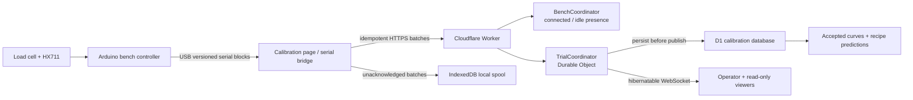

# Calibration System Execution Plan

Status: Proposed for Milestone 2 review.

This plan turns the calibration bench into one system instead of three loosely
related projects. The physical rig, firmware, Cloudflare API, and desktop page
share one protocol, one trial identifier, and one definition of a trustworthy
result.

The system is deliberately over-instrumented for a cocktail horse. The joke
only works if the measurements do.

## Outcome

After this plan is implemented, an operator can:

1. place a graduated cylinder on the load-cell platform;
2. open `/calibration` in a supported desktop browser;
3. connect the bench over USB and tare the scale;
4. run a guarded duty-cycle test against either pump;
5. watch mass, mass-derived volume, duty, elapsed time, and provisional flow in
   real time;
6. lose the network without losing the trial or leaving a pump running;
7. reconnect and project every buffered sample idempotently, without durable
   loss or duplicate effects;
8. compare accepted flow curves for the two tested pump specimens, identified
   by their pump models; and
9. see the predicted pour time for all six recipes, with provenance back to the
   calibration runs that produced each prediction.

No production view may present generated demonstration numbers as measured
data. An untested pump is shown as untested.

## V1 Decisions

| Area | V1 decision | Why |
| --- | --- | --- |
| Controller | Arduino UNO R4 WiFi, connected over USB for the first bench | 5 V GPIO suits the Kamoer control input; USB keeps safety and collection independent of Wi-Fi while leaving a future direct transport available. |
| Host transport | Web Serial in a Chromium desktop browser; 460800-baud compact blocks for 80 SPS transients and 10 SPS for quieter steady work | Avoids putting credentials and TLS in the first firmware while preserving short-test resolution. |
| Live transport | Authenticated bench presence plus HTTP event batches into one `TrialCoordinator` per trial; hibernatable WebSockets out to viewers | Gives a truthful connected-idle state, one ordered trial coordinator, and reconnectable fanout without making the cloud part of pump timing. |
| Durable data | D1 for trials, events, samples, step results, curves, and provenance | The expected data rate is small and relational queries support pump and recipe comparisons. |
| Portable archive | Downloadable manifest plus NDJSON/CSV; private R2 archive after the first physical trial | Keeps raw evidence portable without making R2 a prerequisite for bench bring-up. |
| Scale | Inspect the supplied sensors first. Prefer one 1 kg, four-wire full-bridge beam cell plus one HX711 if that is the actual kit | A single cantilever platform is mechanically simpler and avoids summing four already-complete bridges. |
| Test liquid | Water only for electrical and first flow-map work | Alcohol, food-contact materials, and an exposed brushed motor need separate review. |
| Display | One desktop page with every panel visible; stone palette with `#0047AB` used only for a healthy live connection | Preserves the supplied concept and makes connection state unmistakable. |

The Web Serial bridge is a V1 transport decision, not an API limitation. A
future Wi-Fi transport must emit the same event schema and cannot weaken the
firmware watchdog.

## System Boundary

The cloud never commands an indefinite motor run. The browser sends a bounded
step to the Arduino; the Arduino owns the stop deadline and cuts output on a
watchdog, invalid command, fault, or physical emergency stop.

## Work Packages

### WP1 — Identify and qualify the actual parts

Deliverables:

- photograph the front/back of one load cell, one HX711 board, both pump labels,
  and every connector;
- record load-cell wire count, markings, dimensions, and measured resistance;
- measure Gikfun no-load, startup peak, and primed running current with a
  current-limited supply; validate fault limiting with a dummy load rather than
  deliberately stalling the gearbox;
- inspect Kamoer speed-control and feedback signals with an oscilloscope;
- record graduated-cylinder capacity and empty mass; and
- assign physical specimen IDs rather than treating a model number as an
  individual calibrated pump.

Exit criteria:

- every power and signal pin used by the plan is verified against the received
  part;
- the Gikfun driver current limit and branch protection are based on measurement;
- the Kamoer feedback wire remains disconnected unless its voltage and output
  type are confirmed; and
- the total platform, cylinder, and maximum liquid mass stays comfortably below
  the actual sensor rating.

### WP2 — Build the dry bench and scale

Use [calibration-harness.md](calibration-harness.md) as the build sheet.

Deliverables:

- rigid dry base, independent load-cell sub-base, removable wet tray, and fixed
  outlet support;
- fused 12 V distribution after a latching emergency stop;
- Kamoer control interface and a current-limited bidirectional Gikfun driver;
- one qualified load-cell/HX711 path; and
- labelled, strain-relieved connections with motor wiring kept away from the
  load-cell signal path.

Exit criteria:

- both pumps are off at boot, reset, USB disconnect, and firmware fault;
- the physical emergency stop removes pump power, hardware-forces Kamoer `SP`
  low, and requires a deliberate re-arm while the Arduino remains able to report
  the event;
- the pump and tubing cannot transfer force to the scale platform; and
- the scale passes the provisional zero, drift, hysteresis, and reference-mass
  checks before a pump is run over it.

### WP3 — Implement guarded calibration firmware

Planned location: `firmware/calibration-bench/`.

Deliverables:

- finite-state machine: `BOOT -> IDLE -> TARE -> ARMED -> RUNNING -> SETTLING ->
  COMPLETE`, with `FAULT` reachable from every active state;
- 20 kHz, 0–5 V Kamoer speed output configured with the UNO R4 GPT peripheral;
- Gikfun H-bridge control with current-limit and direction support;
- HX711 acquisition at explicit 10 SPS steady and 80 SPS transient modes, with
  raw counts preserved;
- monotonic sequence numbers, boot ID, qualified device time, readable control
  NDJSON, and compact versioned sample blocks at 460800 baud;
- bounded step commands, heartbeat watchdog, hard maximum run time, and local
  emergency-stop input; and
- pure C++ state/validation logic separated from board I/O so it can be unit
  tested.

Exit criteria:

- `analogWrite()` is not used for the Kamoer control input;
- no command can create an unbounded run;
- simulated serial loss stops the active pump within the documented watchdog
  interval;
- invalid, partial, duplicated, and out-of-state commands cannot energize a
  pump; and
- a dry synthetic run produces gap-detectable, machine-readable frames for a
  complete test ladder;
- an 80 SPS worst-case serial soak has no lost sequence numbers or blocked pump
  deadlines; and
- the MCU clock is checked against a reference over 1 s, 2 s, 5 s, and 60 s and
  its uncertainty is carried into flow results.

### WP4 — Implement the browser bridge

Planned location: `site/src/app/features/calibration/`.

Deliverables:

- feature detection and explicit user-gesture port selection;
- line-framed protocol parser with compact-block expansion, schema validation,
  and bounded buffers;
- command/ack correlation;
- live local view sourced directly from serial frames;
- IndexedDB spool written before cloud upload;
- batches uploaded every 250–500 ms or at 25 events, whichever comes first;
- at-least-once retry and resume using the server's device/boot-specific
  `contiguousProjectedThrough` and `missingRanges`; and
- a clear separation among device, cloud-ack, and viewer-stream health.

Exit criteria:

- disconnecting the Internet for 60 seconds does not interrupt a safe local
  trial;
- reconnect projects every event without durable loss, duplicate effects, or
  changed device timestamps;
- reloading recovers unacknowledged batches; and
- unsupported browsers explain the limitation without pretending to be
  connected.

### WP5 — Add the Cloudflare calibration service

Planned locations: `worker/`, `migrations/`, and root `wrangler.jsonc`.

Use [calibration-software.md](calibration-software.md) for the contract and
schema.

Deliverables:

- Worker-first `/api/*` routing with explicit JSON fallthrough behavior, plus
  deliberate `/calibration` handling for CSP and Web Serial permissions before
  delegating to static assets;
- Cloudflare Access protection and Worker-side Access JWT verification for all
  `/api/v1/operator/*` routes;
- one `BenchCoordinator` per bench for connected-idle presence and one
  SQLite-backed `TrialCoordinator` per trial;
- hashed, expiring bench/trial producer leases bound to operator, bench, device,
  and boot;
- a transactional ingest journal, alarm-driven D1 outbox, contiguous published
  frontier, and crash-safe idempotent projection;
- D1 migrations and prepared, batched writes;
- hibernatable WebSocket snapshot, fanout, replay, and reset behavior;
- structured batch-level logs and traces without secrets or raw payload dumps;
- local writable test bindings, read-only remote PR previews, and isolated
  staging/production bindings; and
- an export containing raw samples, events, trial metadata, calibration
  provenance, row counts, and content hashes.

Exit criteria:

- unauthenticated writes fail;
- a stored event is visible to viewers only after its durable write succeeds;
- retrying the same batch does not add rows or rebroadcast it;
- reusing a batch ID with different content fails;
- reusing a device event with different content or another trial fails;
- an object crash at every outbox stage drains without a missing or duplicate
  public event;
- reconnect reconstructs the same ordered trial; and
- no PR preview can mutate production calibration data.

### WP6 — Build the single-page calibration readout

Use [calibration-ui.md](calibration-ui.md) as the interface specification.

Deliverables:

- live graduated-cylinder and duty-cycle instrument;
- current pump, trial state, collected mass, mass-derived volume, elapsed time,
  and provisional flow;
- both actual pump models with small tested-specimen images or provenance-safe
  illustrations;
- accepted flow-rate comparison with uncertainty and test coverage;
- all six recipes with specimen-scoped estimates in both model-labelled slots
  once publishable curves exist;
- sample/step log and quality flags; and
- explicit never-tested, disconnected, stalled, running, complete, rejected,
  and accepted states.

Exit criteria:

- all required information remains visible without tabs or view toggles at the
  target desktop size;
- `#0047AB` appears only for a currently healthy live link;
- a healthy end-to-end connection is cobalt whether the bench is sampling or
  connected-idle; trial lifecycle remains a separate grayscale state;
- empty states contain no plausible-looking fake results; and
- a result links to its source trials, firmware version, load-cell calibration,
  liquid, tubing, temperature, and fit quality.

### WP7 — Hardware-in-loop acceptance

Run in this order:

1. synthetic serial frames with no driver connected;
2. HX711 and known reference masses;
3. driver connected with motor disconnected;
4. one pump dry electrical test;
5. water prime to waste;
6. one bounded water collection step;
7. one full duty ladder per pump;
8. repeat and holdout runs;
9. USB disconnect while running;
10. Internet disconnect and idempotent replay after a lost acknowledgment; and
11. a second browser joining, disconnecting, and reconstructing the same trial.

Do not proceed to ingredient testing merely because the page looks convincing.

## End-to-End Definition of Done

Milestone 2 planning is complete when this plan and its linked build sheets are
reviewed, remaining owner gates are answered, and implementation can begin
without inventing a pinout, protocol field, storage rule, or UI state.

The integrated calibration system is complete only when:

- the physical stop, firmware watchdog, serial bridge, cloud persistence, and
  readout pass their individual acceptance criteria;
- at least one water trial for each physical pump specimen survives an offline
  and reconnect test;
- raw counts, mass, density conversion, fit window, flow result, and recipe
  prediction remain traceable;
- accepted and rejected repeats are both retained;
- the direct `/calibration` route and live WebSocket work in production; and
- the resulting curve is explicitly scoped to the tested pump, tube, liquid,
  head, voltage, temperature, firmware, and date.

## Implementation Sequence and PR Scope

Keep the work reviewable:

1. **M2 planning PR** — this plan, wiring/build sheets, protocol, schema, UI
   specification, risks, decisions, and open questions.
2. **Bench firmware PR** — state machine, HX711, motor control, serial protocol,
   tests, and a synthetic stream.
3. **Cloud service PR** — Worker, D1 migrations, Durable Object, authorization,
   replay, and integration tests.
4. **Calibration UI PR** — browser bridge, local spool, live readout, comparison,
   recipe predictions, and UI tests.
5. **Physical trial PR** — real datasets, analysis, acceptance evidence, and
   published calibration curves.

This sequencing keeps generated UI work from outrunning the safety firmware and
keeps measured data out of code-review diffs until it exists.

## Primary References

- [Kamoer KPHM600 data sheet](https://m.media-amazon.com/images/I/914PeMOVWiL.pdf)
- [Gikfun AE1207 product page](https://gikfun.com/products/gikfun-12v-dc-dosing-pump-peristaltic-dosing-head-with-connector-for-arduino-aquarium-lab-analytic-diy)
- [Arduino UNO R4 WiFi documentation](https://docs.arduino.cc/hardware/uno-r4-wifi/)
- [HX711 data sheet](https://cdn.sparkfun.com/datasheets/Sensors/ForceFlex/hx711_english.pdf)
- [SparkFun HX711/load-cell hookup guide](https://learn.sparkfun.com/tutorials/load-cell-amplifier-hx711-breakout-hookup-guide/all)
- [MDN Web Serial API](https://developer.mozilla.org/en-US/docs/Web/API/Web_Serial_API)
- [Cloudflare Durable Object rules](https://developers.cloudflare.com/durable-objects/best-practices/rules-of-durable-objects/)
- [Cloudflare Durable Object WebSockets](https://developers.cloudflare.com/durable-objects/best-practices/websockets/)
- [Cloudflare D1 Worker API](https://developers.cloudflare.com/d1/worker-api/)
- [Cloudflare Access JWT validation](https://developers.cloudflare.com/cloudflare-one/access-controls/applications/http-apps/authorization-cookie/validating-json/)
- [Cloudflare static assets with Worker routing](https://developers.cloudflare.com/workers/static-assets/binding/)
