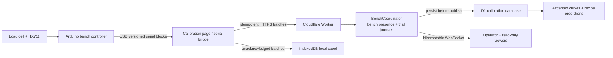

# Calibration System Execution Plan

Status: Milestone 2 software and build-sheet baseline implemented; physical
commissioning remains open.

This plan turns the calibration bench into one system instead of three loosely
related projects. The physical rig, firmware, Cloudflare API, and desktop page
share one protocol, one trial identifier, and one definition of a trustworthy
result.

The system is deliberately over-instrumented for a cocktail horse. The joke
only works if the measurements do.

## Outcome

The Milestone 2 implementation now provides the software path for an operator
to:

1. place the selected 100 mL catch cylinder on the load-cell platform;
2. open `/calibration` in a supported desktop browser;
3. connect the bench over USB and tare the scale;
4. run a guarded duty-cycle test against either pump;
5. watch mass, mass-derived volume, duty, elapsed time, and provisional flow in
   real time;
6. lose the network without losing the trial or leaving a pump running;
7. reconnect and project every buffered sample idempotently, without durable
   loss or duplicate effects;
8. review and explicitly publish accepted flow curves for the two tested pump specimens, identified
   by their pump models; and
9. see the predicted pour time for all six recipes, with provenance back to the
   calibration runs that produced each prediction.

Those capabilities are implemented against local/simulated fixtures, but they
are not yet claims about the physical bench. Motor energization, scale
qualification, a real AVR build/upload, Cloudflare production provisioning, and
the first measured water trials remain gated below.

No production view may present generated demonstration numbers as measured
data. An untested pump is shown as untested.

## V1 Decisions

| Area | V1 decision | Why |
| --- | --- | --- |
| Controller | Supplied Elegoo UNO R3 / ATmega328P, connected over USB | Its 5 V GPIO suits the reviewed Kamoer command interface. Timer1 supplies two 20 kHz hardware channels; 2 KB SRAM requires fixed small buffers. It has no onboard Wi-Fi. |
| Host transport | Web Serial in a Chromium desktop browser at 250000 8N1; compact frames and 10 SPS acquisition for the first physical build | 250000 has an exact divisor at the R3's 16 MHz clock. Short transient work remains gated on physical access to the HX711 `RATE` connection and a loss-free soak. |
| Live transport | Authenticated bench presence plus HTTP event batches into one SQLite `BenchCoordinator` per bench; named trial journals and hibernatable WebSockets live inside that authority | Gives a truthful connected-idle state, enforces one active trial per physical bench, and provides ordered reconnectable fanout without making the cloud part of pump timing. |
| Durable data | D1 for trials, events, samples, step results, curves, and provenance | The expected data rate is small and relational queries support pump and recipe comparisons. |
| Portable archive | Downloadable manifest plus NDJSON/CSV; private R2 archive after the first physical trial | Keeps raw evidence portable without making R2 a prerequisite for bench bring-up. |
| Scale | One of the supplied SazkJere `SJ18` 1 kg four-wire cantilever cells plus one supplied HX711 at its verified 10 SPS default | The exact ASIN listing documents one complete four-wire cell per HX711. Received markings and terminals still require inspection before wiring. |
| Catch vessel | One Qesdaoxu nominal 100 mL borosilicate cylinder from ASIN `B0BLHDVC1N` | It is a catch vessel, not a volume standard. Empty mass, dimensions, and the conservative working fill line are measured before a wet run. |
| Test liquid | Water only for electrical and first flow-map work | Alcohol, food-contact materials, and an exposed brushed motor need separate review. |
| Display | One desktop page with every panel visible; stone palette with `#0047AB` used only for a healthy live connection | Preserves the supplied concept and makes connection state unmistakable. |

The Web Serial bridge is a V1 transport decision, not an API limitation. A
future direct-network transport requires a different controller or external
adapter, must emit the same event schema, and cannot weaken the firmware
watchdog.

## System Boundary

The cloud never commands an indefinite motor run. The browser sends a bounded
step to the Arduino; the Arduino owns the stop deadline and cuts output on a
watchdog, invalid command, fault, or physical emergency stop.

## Work Packages

### WP1 — Identify and qualify the actual parts

Deliverables:

- photograph the front/back of one `SJ18` load cell, one supplied HX711 board,
  the Elegoo board, both pump labels, and every connector;
- record load-cell wire count, markings, dimensions, and measured resistance;
- measure Gikfun no-load, startup peak, and primed running current with a
  current-limited supply; validate fault limiting with a dummy load rather than
  deliberately stalling the gearbox;
- inspect Kamoer speed-control and feedback signals with an oscilloscope;
- record the selected 100 mL cylinder's empty mass, dimensions, and conservative
  working fill line; and
- assign physical specimen IDs rather than treating a model number as an
  individual calibrated pump.

Exit criteria:

- every power and signal pin used by the plan is verified against the received
  part;
- the Gikfun driver current limit and branch protection are based on measurement;
- the Kamoer feedback wire remains disconnected unless its voltage and output
  type are confirmed; and
- the total platform, cylinder, and commanded maximum liquid mass stays below
  both the verified sensor working range and the measured vessel cutoff.

### WP2 — Build the dry bench and scale

Use [calibration-harness.md](calibration-harness.md) as the build sheet.

Deliverables:

- rigid dry base, independent load-cell sub-base, removable wet tray, and fixed
  outlet support;
- fused 12 V distribution through the E-stop-controlled K1/K2 relay/contactor
  chain;
- gated Kamoer control interface and the measurement-qualified Pololu DRV8874
  PH/EN driver for Gikfun;
- one qualified load-cell/HX711 path; and
- labelled, strain-relieved connections with motor wiring kept away from the
  load-cell signal path.

Exit criteria:

- both pumps are off at boot, reset, USB disconnect, and firmware fault;
- the physical emergency stop removes pump power, hardware-forces Kamoer `SP`
  low, and requires a deliberate re-arm while the Arduino remains able to report
  the event;
- a D8 HIGH stall and LOW stall both let the external `CD74HC123E` window expire,
  drop K1/K2, and require physical re-arm; and
- the pump and tubing cannot transfer force to the scale platform; and
- the scale passes the provisional zero, drift, hysteresis, and reference-mass
  checks before a pump is run over it.

### WP3 — Guarded calibration firmware

Implemented location: `firmware/calibration-bench/`.

Deliverables:

- finite-state machine: `BOOT -> IDLE -> TARE -> ARMED -> RUNNING -> SETTLING ->
  COMPLETE`, with `FAULT` reachable from every active state;
- Timer1 fast PWM at 20 kHz on D9/OC1A for Kamoer `SP` and D10/OC1B for the
  Gikfun driver abstraction, with hardware-off endpoint handling;
- Gikfun PH/EN abstraction with direction support for Pololu DRV8874 carrier
  `#4035`, with PMODE held LOW before gated SLEEP rises; current limit and
  closed-enclosure thermal acceptance remain physical measurement gates;
- nonblocking HX711 acquisition on D4/D5 at the as-received 10 SPS default, with
  raw counts preserved and no invented counts-to-mass factor;
- provisioned device ID, EEPROM-backed reset-session counter, monotonic event
  sequence, qualified device time, compact versioned NDJSON at 250000 baud, and
  a 191-byte maximum inbound line with fixed buffers;
- monotonic host command number with one-command duplicate ACK replay; reject
  old/gapped numbers and fault if the same number arrives with changed content;
- bounded step commands, heartbeat watchdog, hard maximum run time, and local
  emergency-stop input; a D8 main-loop toggle retriggers the external edge-loss
  watchdog every 25 ms half-cycle while healthy/non-faulted; and
- one context-bearing terminal state followed by anonymous post-terminal
  samples (`trial:null`, `step:null`, `pump:"none"`, zero duty/timer count), so
  the browser spool can drain and seal after complete, fault, or stop; and
- pure C++ state/validation logic separated from board I/O so it can be unit
  tested.

Exit criteria:

- `analogWrite()` is not used for the Kamoer control input;
- no `String`, dynamic JSON document, or 4096-byte line buffer is used on the
  2 KB-SRAM controller;
- no command can create an unbounded run;
- no physical run is acknowledged while the counts-to-mass calibration is
  absent; raw counts remain available for scale qualification and `massMg`
  remains null;
- simulated serial loss stops the active pump within the documented watchdog
  interval;
- invalid, partial, duplicated, and out-of-state commands cannot energize a
  pump; and
- a dry synthetic run produces gap-detectable, machine-readable frames for a
  complete test ladder;
- a worst-case 10 SPS serial soak has no lost sequence numbers or blocked pump
  deadlines; an 80 SPS soak becomes an exit criterion only after `RATE` is
  physically verified and that mode is implemented; and
- the MCU clock is checked against a reference over 1 s, 2 s, 5 s, and 60 s and
  its uncertainty is carried into flow results.

### WP4 — Browser bridge

Implemented locations: `site/src/app/calibration/` and
`site/src/app/routes/calibration.tsx`.

Deliverables:

- feature detection and explicit user-gesture port selection;
- line-framed protocol parser with compact-block expansion, schema validation,
  and bounded buffers;
- command/ack correlation;
- live local view sourced directly from serial frames;
- IndexedDB spool written before cloud upload;
- batches uploaded every 250–500 ms or at 25 events, whichever comes first;
- at-least-once retry and resume using the server's device/boot-specific
  `contiguousProjectedThrough` and `missingRanges`; and
- a clear separation among device, cloud-ack, and viewer-stream health.

Exit criteria:

- disconnecting the Internet for 60 seconds does not interrupt a safe local
  trial;
- reconnect projects every event without durable loss, duplicate effects, or
  changed device timestamps;
- reloading recovers unacknowledged batches; and
- unsupported browsers explain the limitation without pretending to be
  connected.

### WP5 — Cloudflare calibration service

Implemented locations: `worker/`, `migrations/`, `shared/calibration/`, and root
`wrangler.jsonc`.

Use [calibration-software.md](calibration-software.md) for the contract and
schema.

Deliverables:

- Worker-first `/api/*` routing with explicit JSON fallthrough behavior, plus
  deliberate `/calibration` handling for CSP and Web Serial permissions before
  delegating to static assets;
- Cloudflare Access protection and Worker-side Access JWT verification for all
  `/api/v1/operator/*` routes;
- one SQLite-backed `BenchCoordinator` per bench for connected-idle presence,
  the one-active-trial invariant, named trial journals, replay, and fanout;
- hashed, expiring bench/trial producer leases bound to operator, bench, device,
  and boot;
- a transactional ingest journal, alarm-driven D1 outbox, contiguous published
  frontier, and crash-safe idempotent projection;
- D1 migrations and prepared, batched writes;
- hibernatable WebSocket snapshot, fanout, replay, and reset behavior;
- structured batch-level logs and traces without secrets or raw payload dumps;
- local writable test bindings, read-only remote PR previews, and isolated
  staging/production bindings; and
- an export containing raw samples, events, trial metadata, calibration
  provenance, row counts, and content hashes.

Exit criteria:

- unauthenticated writes fail;
- a stored event is visible to viewers only after its durable write succeeds;
- retrying the same batch does not add rows or rebroadcast it;
- reusing a batch ID with different content fails;
- reusing a device event with different content or another trial fails;
- an object crash at every outbox stage drains without a missing or duplicate
  public event;
- reconnect reconstructs the same ordered trial; and
- no PR preview can mutate production calibration data.

### WP6 — Single-page calibration readout

Use [calibration-ui.md](calibration-ui.md) as the interface specification.

Deliverables:

- live graduated-cylinder and duty-cycle instrument;
- current pump, trial state, collected mass, mass-derived volume, elapsed time,
  and provisional flow;
- both actual pump models with small tested-specimen images or provenance-safe
  illustrations;
- accepted flow-rate comparison with uncertainty and test coverage;
- all six recipes with specimen-scoped estimates in both model-labelled slots
  once publishable curves exist;
- sample/step log and quality flags; and
- explicit never-tested, disconnected, stalled, running, complete, rejected,
  and accepted states.

Exit criteria:

- all required information remains visible without tabs or view toggles at the
  target desktop size;
- `#0047AB` appears only for a currently healthy live link;
- a healthy end-to-end connection is cobalt whether the bench is sampling or
  connected-idle; trial lifecycle remains a separate grayscale state;
- empty states contain no plausible-looking fake results; and
- a result links to its source trials, firmware version, load-cell calibration,
  liquid, tubing, temperature, and fit quality.

### WP7 — Hardware-in-loop acceptance

Run in this order:

1. synthetic serial frames with no driver connected;
2. HX711 and known reference masses;
3. driver connected with motor disconnected;
4. one pump dry electrical test;
5. water prime to waste;
6. one bounded water collection step;
7. one full duty ladder per pump;
8. repeat and holdout runs;
9. USB disconnect while running;
10. D8 held HIGH and LOW to prove the external watchdog and physical re-arm;
11. terminal-context release followed by a drainable/sealable browser spool;
12. Internet disconnect and idempotent replay after a lost acknowledgment; and
13. a second browser joining, disconnecting, and reconstructing the same trial.

Do not proceed to ingredient testing merely because the page looks convincing.

## End-to-End Definition of Done

The Milestone 2 repository slice is complete when its build sheets, firmware,
browser bridge, cloud service, analysis workflow, readout, and fixtures pass
review without inventing a pinout, measurement, protocol field, storage rule,
or UI state.

The integrated calibration system is complete only when:

- the physical stop, firmware watchdog, serial bridge, cloud persistence, and
  readout pass their individual acceptance criteria;
- at least one water trial for each physical pump specimen survives an offline
  and reconnect test;
- raw counts, mass, density conversion, fit window, flow result, and recipe
  prediction remain traceable;
- accepted and rejected repeats are both retained;
- the direct `/calibration` route and live WebSocket work in production; and
- the resulting curve is explicitly scoped to the tested pump, tube, liquid,
  head, voltage, temperature, firmware, and date.

## Milestone 2 Scope and Next Sequence

This PR deliberately carries one reviewable vertical slice: the controlled
build sheet and point-to-point net table, guarded UNO R3 firmware, exact serial
fixture, browser bridge and local spool, authenticated Cloudflare service,
durable realtime projection, measured-data review/publication workflow, and the
single-page readout. Simulation is isolated and permanently labelled; it does
not seed public results.

The next work is evidence-producing rather than speculative implementation:

1. inspect and photograph the received parts, release a controlled schematic,
   and close the measured protection gates;
2. build/upload the firmware with the AVR toolchain and prove every PWM,
   watchdog, reset, stop, and timebase condition on instruments;
3. qualify the load cell with the specified reference and independent check
   masses, then provision its reviewed fixed-point calibration and mass limit;
4. provision Access plus isolated D1/Durable Object production resources and
   deploy the already-tested service; and
5. run bounded water trials, review the retained evidence, and explicitly
   publish curves only after the holdout and external checks pass.

Real datasets belong in a later evidence PR. Until those steps occur, the
production comparison and all recipe durations correctly remain blank.

## Primary References

- [Kamoer KPHM600 data sheet](https://m.media-amazon.com/images/I/914PeMOVWiL.pdf)
- [Gikfun AE1207 product page](https://gikfun.com/products/gikfun-12v-dc-dosing-pump-peristaltic-dosing-head-with-connector-for-arduino-aquarium-lab-analytic-diy)
- [Elegoo UNO R3 product documentation](https://us.elegoo.com/products/elegoo-uno-r3-board)
- [Arduino UNO R3 documentation](https://docs.arduino.cc/hardware/uno-rev3/)
- [ATmega328P data sheet](https://content.arduino.cc/assets/ATmega328P_Datasheet.pdf)
- [HX711 data sheet](https://cdn.sparkfun.com/datasheets/Sensors/ForceFlex/hx711_english.pdf)
- [SparkFun HX711/load-cell hookup guide](https://learn.sparkfun.com/tutorials/load-cell-amplifier-hx711-breakout-hookup-guide/all)
- [SazkJere `SJ18` load-cell/HX711 listing](https://www.amazon.com/dp/B0B9Y584JR)
- [WANPTEK `DPS3010U` listing](https://www.amazon.com/dp/B0CN989377)
- [Qesdaoxu 100 mL cylinder listing](https://www.amazon.com/dp/B0BLHDVC1N)
- [MDN Web Serial API](https://developer.mozilla.org/en-US/docs/Web/API/Web_Serial_API)
- [Cloudflare Durable Object rules](https://developers.cloudflare.com/durable-objects/best-practices/rules-of-durable-objects/)
- [Cloudflare Durable Object WebSockets](https://developers.cloudflare.com/durable-objects/best-practices/websockets/)
- [Cloudflare D1 Worker API](https://developers.cloudflare.com/d1/worker-api/)
- [Cloudflare Access JWT validation](https://developers.cloudflare.com/cloudflare-one/access-controls/applications/http-apps/authorization-cookie/validating-json/)
- [Cloudflare static assets with Worker routing](https://developers.cloudflare.com/workers/static-assets/binding/)
